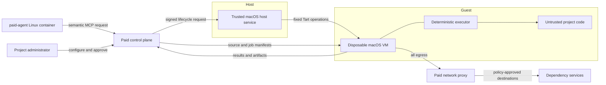

# RDR-068: Apple Platform Verification Workers

> Revise during planning; lock at implementation. If wrong, abandon code and iterate RDR.

## Metadata

- **Date**: 2026-09-18
- **Status**: Partially Implemented
- **Type**: Architecture + Security + Verification
- **Priority**: P1
- **Related RDRs**: [RDR-004](RDR-004-container-isolation.md) (Container Isolation Strategy), [RDR-019](RDR-019-remote-container-execution.md) (Remote Container Execution), [RDR-045](RDR-045-live-web-app-preview-agent-verification.md) (Live Web App Preview and Interactive Agent Verification), [RDR-046](RDR-046-polyglot-language-detection-and-test-execution.md) (Polyglot Language Detection and Test Execution), [RDR-048](RDR-048-multi-host-docker-backend-support.md) (Multi-Host Docker Backend Support), [RDR-057](RDR-057-remote-execution-data-contract.md) (Remote Execution Data Contract), [RDR-058](RDR-058-execution-authority-network-and-isolation.md) (Execution Authority, Network Policy, and Isolation), [RDR-059](RDR-059-immutable-agent-runtime-images.md) (Immutable Agent Runtime Images), [RDR-060](RDR-060-external-execution-resource-ledger.md) (External Execution Resource Ledger), [RDR-061](RDR-061-infrastructure-safety-and-audit.md) (Infrastructure Safety Rails and Execution Audit Events), [RDR-062](RDR-062-execution-network-policy-intent.md) (Provider-Neutral Execution Network Policy Intent)
- **Related Intent**: `docs/intent/apple-verification-workers/` (profiles, workflow revisions, attempts, waivers, host lifecycle), `docs/intent/apple-guest-execution/` (image catalog, guest protocol, guest dispatch), `docs/intent/apple-verification-network-policy/` (guest network contract), `docs/intent/apple-verification/` (project UI presentation), `docs/intent/apple-verification-live-validation/` (live-validation harness for #3978)
- **Related Issues**: #3930 (umbrella implementation chain, open), #3929 (RDR acceptance PR), #3938 (Apple verification configuration and approval lifecycle — closed by PR #3975), #3936 (scheduling, admission, lockdown, timeout, quarantine — open), #3937 (source/result/artifact transport — open), #3940 (agent MCP tools and lifecycle gates — open), #3941 (operator setup guide and guided preflight — open), #3942 (2026-09-22 closeout — open; tracks rather than closes), #3978 (live-host acceptance validation — open; filed from this audit)
- **Related Tests**: `spec/models/apple_verification_workers_spec.rb`, `spec/models/apple_verification_image_spec.rb`, `spec/services/apple_verification_workers_spec.rb`, `spec/services/apple_verification_workers/version_requirement_spec.rb`, `spec/services/apple_verification/`, `spec/services/apple_verification/live_validation/`, `spec/services/apple_verification_workflow_revisions/sync_from_configuration_spec.rb`, `spec/services/agent_runs/apple_verification/`, `spec/lib/apple_verification/`, `spec/requests/projects/apple_verifications_spec.rb`

## Implementation Status

Partially implemented as of Tuesday, September 22, 2026 (see the
[2026-09-22 Closeout](#2026-09-22-closeout) and the
[audit report](audit-report-2026-09-22-rdr-068.md)).

What shipped under #3930 through the #3938–#3941 chain, all behind the
default-off `apple_verification_workers` flag with passing adversarial specs:

- Contracts and persistence: immutable `AppleWorkerProfile`s, project modes,
  RDR-057 input/output manifest validation with forbidden host/credential
  fields and secret-shaped value rejection, digest-bound workflow revisions
  with admin-only approval and immutable approved bindings, attempts with
  gate/binding invariants and revoked-profile rejection, one-attempt waivers,
  protected artifacts (tenant RLS), and audit-event/ledger linkages using the
  `verification_vm` resource kind.
- Trusted host boundary (control-plane side): the authenticated versioned
  `AppleVerification::HostService` fixed-vocabulary lifecycle API that cannot
  express commands, paths, or mounts; Tart/Softnet translation with idempotent
  lifecycle operations, ownership-tag inventory, and restart/orphan recovery;
  the reconciliation-only `TartRunner` configured from environment.
- Guest execution (control-plane side): the immutable `AppleVerificationImage`
  catalog with smoke-test-gated promotion and GUI-account posture validation;
  the closed protocol-v1 guest vocabulary; the HTTPS guest-executor
  connection; and the `ExecuteGuestJob` admission boundary.
- Guest network policy: flag-gated resolution of a proxy-restricted per-run
  egress snapshot into a credential-free declarative guest contract, with
  request-time enforcement and audited denials for direct IP, alternate DNS,
  proxy overrides, and unsupported protocols.
- Repository configuration (under #3938 / PR #3975):
  `.paid/apple-verification.yml` parsing, typed validation, version
  requirement constraints, digest-bound sync from committed configuration,
  and user-confirmed inference from shared schemes and test plans.
- Project UI: mode settings, revision review/comparison/approval, attempt
  status with protected artifact links, rerun/cancel/waive/early-destroy
  controls under `manage_apple_verifications?` policy.

What remains open (each bullet maps to an existing open tracker under
umbrella #3930 — see the [2026-09-22 audit report](audit-report-2026-09-22-rdr-068.md)
§Gaps for the reconciliation):

- Sequential multi-profile execution (parsing shipped under #3938 / PR #3975)
  — **#3936**.
- Scheduling and resource admission: fair queueing, the one-VM/disk/memory
  thresholds, attempt timeout, and cancellation that converges the VM ledger
  — **#3936**.
- Agent-facing semantic MCP tools and the uncommitted-bundle draft-iteration
  lane; lifecycle-gate enforcement against agent completion and PR
  verification — **#3940**.
- Retained-failure lockdown with credential revocation and timed destruction;
  worker quarantine and smoke-test-gated return to service — **#3936**
  (mechanism; #3941 covers the operator runbook).
- Result ingestion populating the failure taxonomy — **#3937**.
- The operator setup guide and guided preflight command — **#3941**.
- All live-VM acceptance evidence: repeated clean-clone builds, tests,
  launches, and captures of the smoke iOS app, `viamin/ColorMatching-iOS`,
  and a native macOS GUI app; live isolation and capacity measurements
  alongside three paid-agent containers — **#3978** (filed from this audit;
  the `bin/apple-verify-live` harness and the
  [live-validation runbook](live-validation-runbook-rdr-068.md) drive and
  archive that evidence).

## 2026-09-22 Closeout

Closeout issue #3942 ran the [RDR Closeout Checklist](closeout-checklist.md)
against `main`; the full criterion-by-criterion evidence tables live in
[audit-report-2026-09-22-rdr-068.md](audit-report-2026-09-22-rdr-068.md).
Test evidence was re-run (299 Apple-related examples, 0 failures) and
`bin/coherence-check.mjs` reports no Apple-related findings.

Decision: **Partially Implemented** — the control-plane contracts, trusted
host boundary, guest protocol/admission, network-policy contract, user UI,
and (under #3938 / PR #3975) the `.paid/apple-verification.yml` parser ship
with strong adversarial coverage, but the agent-interface, scheduling/
admission/lockdown/quarantine/timeout, gate-enforcement, operator-guide,
and live-host acceptance criteria are unmet. The remaining gaps are
tracked by the existing open issues under umbrella #3930 — issue #3936
(scheduling, admission, lockdown, quarantine, timeout, and sequential
multi-profile execution), #3937 (result ingestion and failure taxonomy),
`#3940` (agent MCP tools and lifecycle-gate enforcement), #3941 (operator
setup guide and guided preflight) — plus the live-host acceptance issue
`#3978` (filed from this audit; see the audit report's §Gaps reconciliation
for the mapping). The design baseline is preserved unchanged: no design
deltas were found, and `apple_verification_workers` remains default-off —
broad enablement and flag cleanup wait on the live validation evidence.
Umbrella #3930 stays open (this closeout tracks it rather than closing it).

## Problem Statement

Paid can build and preview web applications because its Linux agent containers can run the application and expose a browser-accessible preview. Native Apple applications require macOS, Xcode, Apple SDKs, and Simulator. Paid and its paid-agents currently run in Linux containers on a macOS laptop, so they cannot verify iOS, iPadOS, or native macOS projects within their existing execution environment.

Running project code directly on the macOS host would violate Paid's isolation model. The host contains the control plane, container runtime, personal data, and credentials. Code authored or modified by Paid must never execute on or gain access to that host.

Paid needs a macOS verification capability that:

- preserves Linux paid-agent containers as the code-authoring environment;
- runs all Apple project code inside an isolated macOS virtual machine;
- supports deterministic build, test, launch, UI-flow, and screenshot operations;
- lets paid-agents iterate on verification workflows without placing an agent in the VM;
- makes blocking verification a user-approved policy decision;
- routes guest network access through Paid's existing policy boundary; and
- remains recoverable, auditable, capacity-aware, and provider-neutral.

## Decision Summary

Add a provider-neutral **Apple verification worker** capability, with Tart as the first macOS virtualization provider.

Paid-agents continue to edit code in their existing Linux containers. When verification is requested, Paid sends an exact source snapshot and a structured verification request to a disposable macOS VM. A deterministic guest executor performs allowlisted operations such as resolving Swift packages, building or testing a scheme, launching an app or Simulator, executing an approved UI flow, and capturing screenshots.

The macOS host runs only a narrow trusted lifecycle service. It may create, start, inspect, stop, and destroy VMs, but it may not run project commands, mount project source into the host, or expose arbitrary shell execution. All project code, including Xcode build phases, tests, UI helpers, and agent-authored workflow assets, remains untrusted and executes only inside the guest.

The first release supports native iOS, iPadOS, and macOS verification. TestFlight, signing for distribution, notarization, packaging, App Store submission, physical-device testing, and privileged Apple application types are deferred.

## Context

### Existing Paid boundaries

Paid already has several contracts that this decision extends rather than replaces:

- RDR-004 establishes that untrusted agent work belongs in an isolated execution environment.
- RDR-045 provides the product precedent for agent verification and preview artifacts.
- RDR-046 detects language and framework capabilities but intentionally does not supply Xcode execution.
- RDR-057 defines provider-neutral input and output manifests and separates structured results from durable artifacts.
- RDR-058 and RDR-062 establish explicit authority and network policy intent.
- RDR-059 establishes immutable, operator-approved execution images.
- RDR-060 establishes durable external-resource identity and reconciliation.
- RDR-061 establishes operational safety and audit requirements.

An Apple verification VM is not another paid-agent runner. It does not host an LLM, coding agent, or `agent-harness`. It is a specialized verification environment invoked by Paid and by paid-agents through semantic control-plane tools.

### Feasibility pilot

A manual pilot validated the core technical assumptions on the intended macOS host:

| Item | Pilot result |
|---|---|
| Host | Apple M1 Pro, 10 cores, 32 GB RAM, macOS 26.6.2 |
| Virtualization | Tart 2.37.0 with a 100 GB macOS VM |
| Guest allocation | 4 virtual CPUs and 8 GB RAM |
| Toolchain | Xcode 26.6 (17F113) and an arm64 iOS Simulator runtime |
| Isolation | Tart Softnet; guest reached permitted Internet resources and could not reach the host SSH service |
| Smoke validation | SwiftUI app built, installed, launched, and produced a “Hello World” screenshot |
| Real-project validation | `viamin/ColorMatching-iOS` built, launched, rendered the expected UI, and passed its configured tests |
| Host load | One VM ran alongside three paid-agent workloads with useful CPU headroom and acceptable memory pressure |

The pilot also showed that disk capacity is the tightest local constraint. Immutable images, Xcode, simulator runtimes, VM clones, derived data, and artifacts require explicit admission checks and cleanup.

### Trust distinction

The verification system has two kinds of code inside the guest:

1. **Trusted deterministic executor** — shipped in an immutable operator-approved image and limited to a versioned operation protocol.
2. **Untrusted project verification code** — repository code, build phases, tests, XCUITests, scripts, helper binaries, and workflow assets written by humans or paid-agents.

User approval makes a particular workflow revision eligible to enforce a lifecycle gate. It does not make project verification code trusted and does not grant it additional authority.

## Goals

- Verify native iOS, iPadOS, and macOS projects without running their code on the host.
- Support builds, unit tests, UI tests, app launches, deterministic UI flows, and screenshots.
- Let paid-agents request verification while keeping agent execution in Linux containers.
- Support iterative workflow bootstrap followed by explicit user approval.
- Provide structured, equivalent results to users and agents.
- Preserve Paid's authority, network, artifact, quota, audit, and reconciliation models.
- Make Tart replaceable through a provider-neutral worker contract.
- Require no per-run operator interaction after initial worker setup.

## Non-Goals

- Run a coding agent, LLM, or general-purpose agent harness inside the macOS guest.
- Run Paid-authored or repository-authored project code on the macOS host.
- Add TestFlight, physical-device testing, distribution signing, notarization, packaging, Mac App Store, or App Store submission in the first release.
- Support system extensions, privileged helpers, kernel extensions, installers, MDM entitlements, or workflows requiring host devices or personal data.
- Support arbitrary project bootstrap or arbitrary host and guest shell commands.
- Support CocoaPods, Carthage, Bazel, Tuist, or other bootstrap systems until each has a deterministic adapter. A repository-contained generated workspace and dependencies may be used without invoking those tools.
- Share mutable dependency or build caches between projects in the first release.
- Make Apple verification a general replacement for Paid's existing execution runners.

## Proposed Architecture



### Control plane

Paid owns policy and orchestration:

- project mode and approval state;
- worker-profile selection;
- source snapshot creation;
- authority and network-policy resolution;
- queueing, quotas, admission, cancellation, and retry;
- lifecycle-gate enforcement;
- artifact ingestion and retention;
- audit events and external-resource ledger entries; and
- semantic MCP operations for paid-agents.

The control plane must not expose virtualization primitives directly to agents. Agents ask Paid to verify a project or capture an approved screenshot; Paid decides how and where that request runs.

### Trusted host service

The host service is a small authenticated process with a versioned API. Its allowlisted operations are limited to:

- report readiness and capacity;
- clone an approved immutable VM image;
- start a VM with an approved CPU, memory, disk, and network profile;
- return opaque VM identity and connection readiness;
- inspect lifecycle state;
- stop or destroy a VM; and
- enumerate Paid-owned resources for reconciliation.

The service must reject arbitrary executable names, command strings, repository paths, host mounts, and unapproved image identifiers. It records Paid ownership tags or equivalent metadata required by RDR-060.

The host service may be implemented as a dedicated authenticated API, an internal MCP server, or both. MCP is a transport option at this boundary, not permission to expose general host tools.

### Deterministic guest executor

The guest contains a deterministic, versioned executor. It accepts a signed or mutually authenticated job manifest and implements a fixed operation vocabulary:

- materialize and digest-verify a source snapshot;
- resolve Swift Package Manager dependencies;
- inspect Xcode projects, workspaces, schemes, test plans, destinations, and supported SDKs;
- build a selected scheme;
- test a selected scheme or test plan;
- boot or select an approved Simulator destination;
- install and launch an app;
- execute a declarative UI flow;
- capture a Simulator screen or macOS app window;
- collect `.xcresult`, logs, structured summaries, and diagnostics; and
- upload an output manifest and artifacts.

It does not accept arbitrary shell text. Xcode may execute repository build phases and test code as part of an approved structured operation; that execution is treated as untrusted project code confined to the VM.

### Worker provider contract

Paid models Apple verification workers independently from Tart. The provider contract covers:

- capability and profile discovery;
- readiness and admission signals;
- idempotent provision, start, stop, and destroy operations;
- opaque handles suitable for resource-ledger recovery;
- guest connection establishment;
- provider inventory for reconciliation; and
- explicit unsupported-capability failures.

The first provider translates this contract to Tart and Softnet. It must not be forced into Docker-specific runner interfaces where the lifecycle or security semantics do not fit.

## Verification Configuration

### Project modes

Each project has one Apple verification mode:

| Mode | Behavior |
|---|---|
| `off` | Apple verification is unavailable for the project. |
| `on_demand` | Authorized users and assigned paid-agents may request verification. |
| `automatic` | Paid schedules approved workflows at their approved lifecycle gates. |

Newly detected Apple projects default to `on_demand`, subject to operator approval of the project-worker relationship. Paid must never silently skip required verification or fall back to host execution.

### Repository configuration

The canonical repository file is `.paid/apple-verification.yml`. It declares versioned verification profiles without credentials, proxy secrets, host paths, or raw virtualization commands.

Illustrative shape:

```yaml
version: 1

profiles:
  ios-app:
    platform: ios
    worker:
      xcode: ">= 26.0, < 27.0"
      simulator: "iPhone 17"
    xcode:
      project: iOS/ColorMatchingLPS.xcodeproj
      scheme: ColorMatchingLPS
    tests:
      required: true
    captures:
      - id: initial-screen
        required: true
        flow:
          - launch_app: {}
          - wait_for_accessibility_id:
              id: main-screen
              timeout_seconds: 15
          - capture:
              name: initial-screen

  mac-app:
    platform: macos
    worker:
      xcode: "~> 26.0"
    xcode:
      workspace: Example.xcworkspace
      scheme: ExampleMac
    tests:
      required: true
```

The schema must use typed fields and reject unknown executable operations. Paid may infer a starting configuration from shared schemes, test plans, manifests, and supported destinations, but a user confirms it before approval.

Mixed repositories may contain multiple profiles. The first release executes them sequentially because worker concurrency is one.

### Supported project inputs

The first release supports:

- `.xcodeproj` and `.xcworkspace` projects;
- shared schemes and Xcode test plans;
- Swift Package Manager dependencies;
- iOS and iPadOS Simulator destinations; and
- native macOS applications, libraries, command-line tools, unit tests, and UI tests.

Screenshots apply to GUI applications. Libraries and command-line tools can build and test without capture requirements.

Paid detects unsupported bootstrap requirements and fails before provisioning when possible. It reports the missing deterministic adapter rather than attempting an arbitrary setup script.

## Workflow and Approval Lifecycle

### Workflow states

Workflow revisions use four states:

- `draft` — available for iterative, advisory execution;
- `approved` — eligible to enforce its approved lifecycle gate;
- `superseded` — replaced by another approved revision but retained for audit;
- `disabled` — unavailable for scheduling or enforcement.

Approval binds all of the following:

- project;
- committed workflow content digest;
- referenced committed verification files;
- verification profile;
- resolved worker-profile constraints;
- lifecycle gate; and
- required versus advisory checks.

A functional change creates a new draft revision. The previous approved revision remains active until an authorized user replaces or disables it. Uncommitted workflow revisions may run during agent iteration but cannot become blocking.

### Approval authority

- A project administrator approves workflow behavior, required checks, screenshots, and lifecycle gate.
- A Paid operator approves the project's use of Apple workers and any expansion of image capabilities, guest privileges, or network policy.
- Paid-agents may author, revise, propose, and execute workflows but cannot approve them.

Approval does not confer trust on project code.

### Lifecycle gates

The first release has named gates:

| Gate | Semantics |
|---|---|
| `agent_iteration` | Advisory feedback while a paid-agent is developing code or bootstrapping verification. |
| `completion_verification` | An approved required workflow may block an agent run from reporting success. |
| `pull_request_verification` | An approved required workflow may block Paid's PR verification result. |

Moving a workflow revision to a different gate requires approval. A missing or failed screenshot is blocking only when the approved revision marks it required and assigns it to the current gate.

### Waivers

A project administrator may waive one specific required attempt. The waiver records:

- actor and required reason;
- source digest and workflow revision;
- failed, missing, or unavailable checks;
- attempt identity;
- creation and expiry; and
- affected lifecycle gate.

A waiver does not modify the workflow, approve a new revision, or apply to future attempts. Paid-agents cannot create waivers.

## Source and Credential Transfer

### Committed source

For committed source, Paid supplies the exact commit identity and a short-lived GitHub App installation credential scoped read-only to the target repository. The credential is delivered through Paid's credential lane and never stored in repository configuration, artifacts, VM images, or host-service arguments.

### Uncommitted source

During agent iteration, Paid creates a content-addressed workspace bundle from the paid-agent container. Bundle creation:

- excludes credentials, caches, derived data, build outputs, and forbidden artifacts;
- performs the existing secret and artifact safety checks;
- records a manifest and content digest;
- transfers through Paid's artifact lane without a host bind mount; and
- requires guest digest verification before execution.

The bundle is deleted after the attempt and retry window. Paid retains its digest, safe manifest, provenance, and result association. A retained failed VM may contain a private copy until its retention deadline, with credentials revoked and network access disabled.

## Network Policy

The VM has no uncontrolled external route. All guest network access crosses Paid's network-policy enforcement and proxy infrastructure.

The boundary must prevent bypass through:

- direct IP connections;
- alternate DNS servers;
- unsupported protocols;
- project-supplied proxy configuration; or
- raw proxy credentials.

Paid resolves effective policy from platform, tenant, operator, project, and run authority. Operators and authorized Paid users can allow or block domains and resources through the existing policy model. Dependency access uses the same governed path.

Network audit data records destination and policy-decision metadata without recording credentials or payload bodies. An unsupported protocol or denied destination produces a clear policy failure distinct from a build failure.

## UI Automation and Screenshots

### Declarative flows

Repository configuration expresses deterministic actions such as:

- launch an app;
- wait for a process, window, or accessibility identifier;
- tap, type, or select by accessibility identifier;
- rotate a Simulator or resize a supported macOS window;
- wait for an explicit readiness condition; and
- capture a named screen or app window.

Natural-language action steps are rejected. Project-owned XCUITest targets may drive more complex flows as untrusted project code.

Paid-agents may design and iteratively revise declarative flows and their project-owned verification helpers. During bootstrap, draft captures are advisory. After a user approves a committed revision, required captures may fail only the approved lifecycle gate.

### Capture behavior

- iOS and iPadOS capture the selected Simulator screen.
- macOS launches the application in a dedicated guest GUI session, waits for a visible window, foregrounds the configured window, and captures that app window.
- The default inferred GUI flow is one required first-launch screenshot, but it remains advisory until approved.
- Capture failures report whether launch, readiness, window selection, action execution, or image export failed.

Screenshots and recordings are private project artifacts. Paid links to protected artifact views from PR status; it does not publish images into public PR comments by default.

## Worker Profiles and Guest Session

Operators publish immutable, versioned profiles containing:

- macOS version and build;
- Xcode version and build;
- installed SDKs and Simulator runtimes;
- deterministic executor version;
- CPU, memory, and disk envelope;
- network mechanism and capability declaration; and
- image digest and smoke-test result.

Projects may pin a profile or declare compatible constraints. Projects cannot mutate Xcode, install arbitrary runtimes, or convert a worker image into a new approved profile.

Each image has a dedicated non-admin verification account configured to enter an isolated GUI session automatically. The account has no Apple ID, personal data, host credentials, distribution signing identity, or persistent secret-bearing keychain. Guest screen locking may be disabled so unattended GUI verification remains available.

Operators may deprecate a profile with a migration window, prevent new approvals against a retired profile, or immediately revoke a security-compromised profile. Required verification remains pending until a compatible approved profile is available.

## Scheduling and Resource Admission

The first deployment supports one active Apple verification VM. Attempts queue fairly by account and project and expose queue position and cancellation.

Initial operator-configurable admission defaults are:

| Resource | Default |
|---|---:|
| Active Apple verification VMs | 1 |
| Minimum free host disk before clone | 60 GiB |
| Minimum system memory free | 25% |
| Minimum free guest disk | 15 GiB |
| Attempt timeout | 45 minutes |

Paid also refuses admission during sustained critical memory pressure. It rechecks disk and memory while a job runs. Crossing a normal admission threshold stops new work; a running attempt is terminated only for an actual host-safety condition.

Limits are configurable for queue depth, runtime, retry count, retained storage, and attempts per agent run. Capacity exhaustion and infrastructure timeout are infrastructure results, never code failures. Required verification remains pending until it runs or is explicitly waived.

## Attempt Lifecycle and Recovery

Each attempt uses a clean clone of an approved immutable image:

1. Validate project approval, workflow state, source identity, capabilities, policy, and quota.
2. Reserve capacity and create a provisioning intent in the external-resource ledger.
3. Clone and start the VM through the host service.
4. Establish the dedicated guest GUI session and deterministic-executor channel.
5. Transfer and verify source plus job manifests.
6. Execute structured operations and stream safe state transitions.
7. Upload the output manifest and artifacts.
8. Revoke credentials and disable the attempt's network authority.
9. Destroy a successful VM immediately.
10. Retain a failed VM for up to one hour by default, or destroy it early on request.

Lifecycle operations are idempotent. Paid persists enough state to reconcile after a control-plane restart, host restart, network interruption, timeout, or partial provisioning failure. Unknown or orphaned Paid-owned VMs are quarantined or destroyed according to ledger state; they are never adopted as healthy without validation.

Repeated worker health failures quarantine the worker, revoke active credentials, and stop scheduling. An operator repairs or replaces it and explicitly returns it to service only after the isolation smoke test passes.

## Results and Artifacts

Each attempt returns a structured result containing:

- terminal state, timings, retry lineage, and failure classification;
- source digest, commit identity, workflow revision, and lifecycle gate;
- worker profile, image digest, macOS, Xcode, SDK, and runtime versions;
- selected project, workspace, scheme, test plan, and destination;
- parsed build and test summaries;
- required and advisory check outcomes;
- screenshot metadata and protected artifact references;
- `.xcresult`, build logs, screenshots, and safe diagnostics;
- network-policy denials and infrastructure events; and
- external-resource ledger and audit-event references.

Large artifacts use Paid's existing artifact storage and retention policy. Metadata and provenance remain after binaries expire.

Failures use explicit classes:

- project configuration;
- compile or link;
- test assertion;
- launch or UI-flow;
- required capture;
- network policy;
- unsupported capability;
- capacity or quota;
- worker infrastructure; and
- cancellation or timeout.

Paid may retry safe infrastructure failures within policy. It must not silently retry deterministic project failures or represent infrastructure failure as a code defect.

## Agent and User Interfaces

### Semantic MCP operations

Paid may expose semantic agent tools such as:

- `verify_apple_project`;
- `get_apple_verification`;
- `capture_apple_screenshot`; and
- `stop_apple_verification`.

An assigned paid-agent may submit its source, execute draft or approved workflows on demand, inspect results, and cancel its own active attempts. It cannot approve workflows, enable automatic mode, alter network policy, select privileged images, create waivers, or exceed project quotas.

### Paid UI

The UI presents one verification check with profiles and attempts. Each attempt exposes build and test state, required and advisory captures, screenshot thumbnails, full artifacts, provenance, policy denials, and failure classification.

Authorized users can:

- configure project mode and profiles;
- review and approve a draft workflow revision;
- compare revisions;
- rerun or cancel an attempt;
- waive a specific required attempt with a reason; and
- destroy a retained failed VM.

Agents receive the same structured state through MCP rather than scraping user-facing logs.

## Operator Setup and Maintenance

Initial installation uses a guided setup command and a canonical Markdown guide. The guided command performs read-only preflight checks before proposing changes, validates installed dependencies and host capacity, helps create and register an image, and runs the isolation smoke test.

One-time operator actions include:

- grant macOS virtualization permission;
- install and validate Tart and Softnet;
- create the base image;
- install Xcode, accept its license, and install approved Simulator runtimes;
- register and authenticate the host service;
- configure Paid-controlled network proxying;
- create the dedicated guest account and GUI session;
- publish the immutable worker profile; and
- approve the readiness and isolation smoke tests.

No Apple ID is required for first-release build, test, Simulator, or screenshot operation. Routine project configuration, workflow approval, and verification require no VM login.

## Security Invariants

The implementation must preserve all of these invariants:

1. Project code never executes on or accesses the macOS host.
2. The host service cannot execute arbitrary commands or accept host paths from Paid, projects, or agents.
3. Source enters the VM only through an exact commit or a validated content-addressed bundle.
4. No host source mount, writable cache mount, personal directory, device, or keychain is exposed to the guest.
5. The guest contains no LLM or coding agent as part of verification execution.
6. Agent-authored verification code remains untrusted after workflow approval.
7. Guest network traffic cannot bypass Paid's effective network policy.
8. Manifests, repository configuration, logs, and artifacts never contain raw credentials.
9. Successful attempts destroy their VMs promptly; retained failures have credentials revoked and networking disabled.
10. Paid never falls back to host execution or silently skips required verification.
11. Blocking behavior is tied to an approved committed workflow digest and approved lifecycle gate.
12. Every external VM is represented in the resource ledger and covered by reconciliation.

## Alternatives Considered

### Run Xcode directly on the macOS host

Rejected. This gives untrusted repository build phases and tests access to the host security boundary and violates the central requirement that Paid-written code never execute on the host.

### Let paid-agents run directly in macOS VMs

Rejected for the first release. It duplicates the existing Linux agent environment, expands credential and tool exposure, and combines semantic agency with the verification trust boundary. Paid-agents remain in their existing containers and invoke the VM as a tool.

### Use Colima or another Linux container runtime

Rejected for Apple verification. Linux containers cannot supply macOS, Xcode, or Simulator. Colima may remain useful for Linux workloads but does not solve this capability.

### Use a second dedicated Mac immediately

Deferred. A separate Mac can implement the same provider-neutral contract later and may be desirable for capacity. The successful local Tart pilot makes an additional machine unnecessary for the first release.

### Use a hosted macOS CI provider only

Deferred as an additional provider. Hosted CI can build and test but may offer weaker interactive screenshot iteration, different network controls, slower feedback, and ongoing cost. The contract should permit a hosted provider later without making it the first dependency.

### Start with TestFlight

Rejected for the first release. TestFlight adds distribution signing, App Store Connect credentials, provisioning, review delays, device enrollment, and longer feedback cycles before basic simulator verification is established.

### Put a coding agent in the guest

Rejected. The VM is a deterministic verification worker. Agent reasoning and code edits stay in the existing paid-agent environment.

### Allow arbitrary repository setup commands

Rejected. Arbitrary commands would turn a narrow verification protocol into a general remote shell and make capability, approval, and audit boundaries ambiguous. New build systems require deterministic adapters.

## Trade-offs and Consequences

### Benefits

- Apple projects gain concrete build, test, and visual evidence inside Paid.
- The host remains outside the project-code execution boundary.
- Paid-agents can iteratively improve verification without a macOS agent environment.
- Explicit workflow approval prevents an experimental capture from unexpectedly blocking delivery.
- Immutable profiles make results reproducible and operationally supportable.
- Provider neutrality leaves room for another Mac or hosted macOS capacity later.

### Costs

- macOS images, Xcode, runtimes, clones, and artifacts consume substantial disk.
- A host service and guest executor add two authenticated operational components.
- UI automation requires accessible, deterministic application states.
- One-worker concurrency can create queues during bursts.
- Xcode and macOS version maintenance is operator work.
- Denying arbitrary bootstrap commands limits the projects supported initially.

### Risks and mitigations

| Risk | Mitigation |
|---|---|
| Project code escapes into host context | No host mounts or project-command API; Softnet and Paid proxy; isolation smoke tests |
| Host disk exhaustion | Preflight and continuous capacity checks, one-worker limit, prompt cleanup, short failure retention |
| Workflow changes bypass approval | Content-digest approval and immutable revision history |
| Screenshots expose sensitive UI | Private artifacts, project RBAC, retention policy, protected links |
| Dependency traffic bypasses policy | Boundary-enforced proxy and DNS; deny unsupported protocols and direct IP access |
| Stale or orphaned VMs retain authority | Resource ledger, credential revocation, reconciliation, quarantine, expiry |
| Toolchain drift breaks reproducibility | Immutable profiles with version constraints, smoke tests, deprecation, and revocation |
| Infrastructure problems are blamed on code | Explicit failure taxonomy and retry policy |

## Rollout Guard

Ship runtime behavior behind a default-off feature flag named `apple_verification_workers`.

- **Definition**: add the key to `FeatureFlags::DEFINITIONS` in the first runtime implementation issue.
- **Decision point**: all UI, API, MCP, scheduler, and automatic-gate paths call `FeatureFlags.enabled?(:apple_verification_workers, project:)` before exposing or scheduling the capability.
- **Enablement**: operators enable selected pilot projects only after the worker profile, network proxy, and isolation smoke test pass.
- **Rollback**: disable the flag, stop new admission, cancel or drain active attempts according to host safety, revoke active credentials, and reconcile/destroy Paid-owned VMs.
- **Cleanup**: remove the flag only after the closeout audit verifies the acceptance criteria across selected iOS and macOS projects and broad enablement is approved.

Project mode remains an independent config gate. Enabling the feature flag does not automatically change any project from `off` or approve a workflow.

## Implementation Plan

The issue tree created from this RDR should preserve these dependencies and end with a closeout issue.

### Phase 0: LID intent cascade

- Update the HLD to place Apple verification workers in Paid's execution and verification architecture.
- Add or update LLD segments for Apple verification control, worker lifecycle, verification workflows, and artifact results.
- Write EARS claims for all security invariants, approval transitions, failure semantics, and operator behaviors.
- Update the arrow overlay and reserve `@spec` identifiers before production code.

### Phase 1: Contracts and persistence

- Define Apple worker capabilities, immutable worker profiles, and provider interface.
- Extend remote input/output manifests for verification jobs and artifacts without exposing provider-specific fields.
- Model project mode, profiles, workflow revisions, approvals, attempts, waivers, and lifecycle gates.
- Integrate external-resource ledger and execution audit events.
- Add the default-off rollout flag.

### Phase 2: Trusted host and Tart provider

- Implement the authenticated narrow host service.
- Implement Tart and Softnet translation behind the provider interface.
- Add readiness, capacity, ownership metadata, lifecycle idempotency, and inventory reconciliation.
- Build the guided operator setup command and Markdown guide.
- Automate the host-isolation and network smoke tests.

### Phase 3: Immutable image and guest executor

- Define the image build and promotion process.
- Implement the deterministic versioned guest protocol and allowlisted operations.
- Configure the non-admin GUI account and readiness checks.
- Implement source materialization, digest validation, credential expiry, and artifact upload.
- Add iOS Simulator and macOS window-capture adapters.

### Phase 4: Policy, proxy, and scheduling

- Route all guest egress through Paid policy enforcement.
- Enforce authority grants, domain/resource decisions, DNS behavior, and protocol rejection.
- Implement fair queueing, one-worker admission, quotas, thresholds, cancellation, and retry classification.
- Implement retained-failure lockdown and timed destruction.

### Phase 5: Project configuration and workflow approval

- Implement `.paid/apple-verification.yml` parsing, validation, inference, and diagnostics.
- Implement workflow revision states, digest-bound approvals, replacement, disabling, and gate enforcement.
- Support draft iteration from uncommitted source bundles.
- Implement administrator waivers and audit history.

### Phase 6: User and agent interfaces

- Add project settings, approval review, attempt status, artifact views, comparisons, rerun, cancel, waiver, and early-destroy controls.
- Add semantic MCP tools with project-bound authorization.
- Integrate required results with agent completion and PR verification gates.
- Keep screenshots private and expose protected artifact links.

### Phase 7: Validation and closeout

- Run all acceptance scenarios on selected pilot projects behind the feature flag.
- Validate recovery after cancellation, timeout, host restart, control-plane restart, and orphan discovery.
- Audit source, credential, artifact, network, and host isolation boundaries.
- Measure capacity alongside three paid-agent containers.
- Complete the RDR closeout checklist, document gaps, update status, and decide whether to broaden rollout.

## Acceptance Criteria

### Functional

- A clean VM clone repeatedly builds, tests, launches, and captures the smoke iOS app.
- A clean VM clone repeatedly builds, tests, launches, and captures `viamin/ColorMatching-iOS`.
- A representative native macOS GUI application builds, tests, launches, and produces an app-window screenshot.
- A mixed repository can execute multiple iOS/macOS profiles sequentially.
- A paid-agent can run an uncommitted draft, inspect results, revise deterministic workflow code, and rerun.
- A project administrator can approve a committed workflow digest and make a required screenshot enforce the selected gate.
- Changing an approved workflow creates a draft and cannot silently alter the enforced revision.
- Build/test-only profiles work without screenshot requirements.

### Security

- Guest project code cannot reach the host SSH service, host filesystem, personal data, keychain, devices, or container runtime.
- The host service rejects arbitrary commands, repository paths, and unapproved images.
- Guest traffic cannot bypass Paid policy by direct IP, alternate DNS, proxy override, or unsupported protocol.
- Revoked or expired credentials cannot be used by a retained failed VM.
- Secret scanning confirms manifests, logs, screenshots metadata, and artifacts do not expose credentials.
- No verification path can fall back to host execution.

### Reliability and operations

- Provision, start, stop, destroy, retry, and reconciliation operations are idempotent.
- Cancellation, timeout, host restart, control-plane restart, and orphaned-VM scenarios converge to a known ledger state.
- Infrastructure and policy failures are distinguishable from project failures.
- Admission prevents a new clone below configured host or guest thresholds.
- One Apple worker can operate alongside three active paid-agent containers within the pilot host's accepted resource thresholds.
- Successful VMs are destroyed promptly and failed VMs lock down and expire as configured.
- A quarantined worker cannot receive work until an operator passes the isolation smoke test and returns it to service.

### Product and audit

- Users and agents receive equivalent structured verification state.
- Every approval, waiver, lifecycle transition, network denial, artifact, and external resource is attributable to its actor and attempt.
- Public PR surfaces do not expose screenshots by default.
- The feature remains unavailable unless both the rollout flag and project policy permit it.
- The canonical Markdown setup guide is sufficient for a new operator to reproduce the worker and pass its smoke tests.

## Validation Strategy

- Unit-test typed configuration, manifests, approval digests, gate decisions, failure classification, capability matching, and admission thresholds.
- Contract-test the host provider and deterministic guest protocol with invalid commands, stale identities, retries, and duplicate requests.
- Run provider conformance tests for Tart lifecycle, ownership inventory, and reconciliation.
- Exercise network policy with allowed domains, denied domains, direct IPs, alternate DNS, and unsupported protocols.
- Run end-to-end tests from paid-agent source snapshot through VM destruction and artifact display.
- Perform adversarial isolation tests against host services, mounts, credentials, and retained failed VMs.
- Measure host disk, memory pressure, CPU, queue latency, and cleanup behavior under the agreed pilot load.
- Use the RDR closeout checklist to compare shipped code and intent before broad rollout.

## Deferred Work

Later RDRs may add:

- TestFlight and App Store Connect integration;
- distribution signing, notarization, and packaging;
- physical-device testing;
- additional macOS hosts or hosted macOS providers;
- deterministic adapters for CocoaPods, Carthage, Bazel, Tuist, and other project systems;
- scoped content-addressed dependency caches; and
- higher concurrency after measured capacity and scheduling work.

These additions must preserve the host isolation, deterministic guest, authority, network, approval, and audit boundaries established here.

## References

- [Tart documentation](https://tart.run/)
- [Apple: Running your app in Simulator or on a device](https://developer.apple.com/documentation/xcode/running-your-app-in-simulator-or-on-a-device)
- [Apple: `xcodebuild`](https://developer.apple.com/library/archive/technotes/tn2339/_index.html)
- [RDR-004](RDR-004-container-isolation.md)
- [RDR-045](RDR-045-live-web-app-preview-agent-verification.md)
- [RDR-057](RDR-057-remote-execution-data-contract.md)
- [RDR-058](RDR-058-execution-authority-network-and-isolation.md)
- [RDR-059](RDR-059-immutable-agent-runtime-images.md)
- [RDR-060](RDR-060-external-execution-resource-ledger.md)
- [RDR-061](RDR-061-infrastructure-safety-and-audit.md)
- [RDR-062](RDR-062-execution-network-policy-intent.md)
