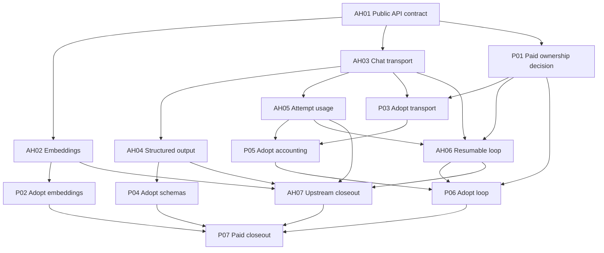

# API Conversation Delegation: Cross-Repository Issue Drafts

## Baseline and Filing Contract

This proposed issue tree accompanies
[RDR-072](RDR-072-api-conversation-delegation.md), currently **Draft**.
No issues have been opened by this document. AH02/P03-style keys are local
identifiers, not GitHub issue numbers. Proposed API names describe capabilities;
the upstream design task chooses final names.

Each issue body consists of its draft section plus the applicable shared
acceptance requirements below. At filing, copy those requirements into each
body, replace local dependency keys, add the merged design URL and retain the
scope, validation and removal criteria. Refresh code and issue state and read
relevant comments before reusing or superseding existing work.

1. Create the two coordination epics and their children under the repository's
   effective planning hold. Epics are not runnable implementation tasks.
2. Replace local dependencies with explicit lines such as
   `Depends on viamin/agent-harness#123` or `Depends on viamin/paid#456`.
   Parent/child links and bare mentions do not replace dependency text.
3. Read back bodies, verify acyclic dependencies and release design tasks.
   Implementation remains held until its scoped design is merged and real
   prerequisites are fulfilled. Embeddings need not wait for the loop decision.
4. Hold each Paid adoption issue until a maintainer verifies a published,
   installable harness release containing its required behavior. Record version,
   release URL, RubyGems URL and contract-test evidence. Upstream closure, merge
   or a Git tag alone does not establish publication.
5. If upstream is not synced into the same Paid account, its dependency remains
   externally blocked. After verification, remove fulfilled dependency text
   from every active body/comment containing it, retaining evidence as a
   non-blocking historical link. A new comment does not cancel a body dependency.
6. Keep closeout tasks runnable after dependencies settle. Close epics through
   successful closeouts, not intermediate capability PRs.

## Shared Acceptance Requirements

### Agent-harness children

- Publish documented provider-neutral contracts and tests. RubyLLM private
  objects and Rails persistence must not become accidental consumer requirements.
- Support request-local credentials, endpoints, headers, timeouts and applicable
  cancellation. Concurrent calls must not share mutable credential configuration;
  errors and logs must not expose secrets.
- State capability failures and supported providers/protocols explicitly.
  Preserve CLI/subscription execution and existing exception contracts.
- Assign retry ownership, bound attempts and expose attempted provider/model
  identities. Avoid a harness/RubyLLM double retry multiplier.
- Document release availability and consumer migration. Implementation can
  close before publication, but downstream adoption remains held until verified.

### Paid children

- Follow HLD -> affected LLD/EARS -> failing-first tests -> code. Reuse claims
  and allocate new IDs in the owning segment when behavior changes.
- Keep calls through agent-harness; preserve tenant context, authorization,
  secrets-proxy routing and audit attribution.
- Use a verified harness release in host and agent runtime. Preserve subscription
  discovery/recovery currently protected by #3995; a newer version number alone
  is insufficient evidence. Coordinate dependency updates across adoption tasks.
- Run affected tests, lint and coherence checks; document image rebuilds and
  live checks needed before claiming deployment verification.
- Delete superseded mechanics while retaining necessary CLI parsing and Paid
  policy. Do not remove behavior just to meet a line-count target.

## Existing Work and Overlap

Read-only GitHub checks on 2026-09-24 found these relevant records. This is a
filing input, not an exhaustive historical audit.

| Record | Treatment |
|---|---|
| [Paid #2146](https://github.com/viamin/paid/issues/2146), closed | Earlier embedding adoption; the initializer still references it while supplying local support. P02 finishes patch removal, rather than claiming native upstream support already shipped. |
| [Paid #3995](https://github.com/viamin/paid/issues/3995), open | Current release-pin follow-up. Coordinate adoption and preserve its discovery/recovery acceptance criteria. |
| [Paid #3952](https://github.com/viamin/paid/issues/3952), open | Older pin follow-up. Reconcile with #3995 rather than create competing version updates. |
| [Harness #408](https://github.com/viamin/agent-harness/issues/408), open | Authority across provider switches; related discussion, not a delivered API or automatic prerequisite. |
| [Inbox implementation tree](human-centered-inbox-implementation.md) | Concurrent RDR-069 through RDR-071 chat work. Recheck actor attribution and collaboration semantics when changing shared chat services. |

The inspected upstream main tree did not expose an RDR/ADR convention. AH01
uses a design issue and upstream API documentation. Embeddings and structured
output need no separate RDR; the Paid chat ownership decision belongs in P01.

## Dependency Graph

Arrows mean prerequisite -> dependent. Epics are omitted because containment
does not imply an execution dependency. Each Paid adoption also has its release
prerequisite from the filing contract.

## Harness Epic AH00: Reusable API Execution Through RubyLLM

**Repository:** `viamin/agent-harness`.
**Children:** AH01-AH07. **Dependencies:** none; coordination only.

Provide reusable API capabilities so consumers can remove transport patches
and conversation mechanics while retaining application authority. Completion
requires AH07 evidence and published contracts. Paid models, Pundit and tenant
schemas stay out of the gem.

## AH01: Define the Provider-Neutral API Execution Contract

**Dependencies:** none. **Type:** design and contract investigation.

Inspect existing transport, conversation, error and result interfaces. Design
incremental embedding/chat/schema/usage contracts and investigate state
export/import. Persist the RubyLLM mapping and alternatives in upstream docs.

**Acceptance criteria:**

- [ ] Document request configuration, normalized messages/tools, streaming,
  parsed results, attempt usage and explicit unsupported-capability outcomes.
- [ ] Specify transient retry versus auth/configuration failure, cancellation,
  partial streams and caller-controlled fallback candidates/credentials.
- [ ] Demonstrate whether restart-safe state restoration works without consumer
  Rails models or RubyLLM tables; identify stable attempt/tool IDs and ownership.
- [ ] Document crash-after-side-effect limitations, minimum runtime/dependency
  compatibility and plain Ruby use. Supply findings for P01; loop feasibility
  may remain negative without blocking the smaller capabilities.

## AH02: Provide Native Embedding Support

**Dependencies:** AH01.

Implement the public embedding operation using RubyLLM, replacing the need for
Paid's host/container transport extensions.

**Acceptance criteria:**

- [ ] Accept batches, model, dimensions, endpoint, credentials, extra headers
  and timeout; return vectors in input order and reported batch usage.
- [ ] Test empty input, ordering, malformed results, 401/403, 429/Retry-After,
  timeout and transient server failures with bounded retries.
- [ ] Preserve unknown usage; do not label allocated per-vector tokens as
  measured provider usage. Document any allocation strategy.
- [ ] Cover direct and proxy endpoints with external HTTP fixtures and publish
  migration instructions for downstream patch removal.

## AH03: Normalize API Chat Transport, Tools and Streaming

**Dependencies:** AH01.

Expose conversations/tools without caller-owned Anthropic/OpenAI encoding.
Use RubyLLM protocols behind the agreed public interface.

**Acceptance criteria:**

- [ ] Cover system messages, multi-tool calls/results, empty content, ordered
  streamed text and explicit completion/error events with normalized results.
- [ ] Test Anthropic, OpenAI and supported compatible endpoints; explicitly
  select the appropriate protocol when an endpoint lacks Responses support.
- [ ] Preserve model/output limits and request-local credentials; document
  custom endpoint support and unknown-model behavior.
- [ ] Interruption/fallback cannot append abandoned partial output to a new
  response or replay completed application tool side effects.

## AH04: Expose Schema-Constrained Parsed Responses

**Dependencies:** AH03.

Expose schemas and parsed results through the harness response contract.
Structured output existed before RubyLLM 2.0.

**Acceptance criteria:**

- [ ] Valid responses expose parsed data alongside normal response metadata.
- [ ] Unsupported capability, refusal, truncated output and invalid JSON have
  explicit outcomes; none become successful empty objects.
- [ ] Test supported schemas and required fields. Document CLI/subscription
  behavior without silently changing authentication or execution modes.

## AH05: Expose Attempt-Level Usage and Cost

**Dependencies:** AH03.

Expose normalized API usage, including reported failed/retried attempts, with
attribution usable across resume and fallback.

**Acceptance criteria:**

- [ ] Report stable attempt identity, provider/model, outcome, available
  input/output/cache usage and cost provenance.
- [ ] Keep unknown counts/prices distinct from zero; do not fabricate absent
  usage. Preserve completion-time pricing when records are restored.
- [ ] Test retries, fallback, cancellation, partial usage, repeated delivery
  and reload; document consumer deduplication responsibilities.
- [ ] Provide observability hooks without logging prompts/credentials by default;
  identify non-RubyLLM paths outside this ledger.

## AH06: Provide Resumable Tool-Loop Controls

**Dependencies:** AH03, AH05, P01.

Implement the finalized loop contract only if P01 selects delegation. Keep
application tool execution and approval authority injectable.

**Acceptance criteria:**

- [ ] Provide stepping, pending decisions, approve/deny, completion, cancellation
  and state restoration with stable call identities.
- [ ] Test mixed batches, multiple pending approvals, denial, bounded iteration
  and process restart through the agreed persistence contract.
- [ ] Let the application enforce authorization and atomic execution claims;
  no model argument substitutes for application approval.
- [ ] Specify crash recovery around side effects, preserve completed results
  on retry/fallback, and test idempotency/reconciliation behavior.
- [ ] If P01 rejects delegation, explicitly defer AH06 and revise AH07/P07
  scope and dependencies before declaring the narrower project complete.

## AH07: Verify and Release Upstream Capabilities

**Dependencies:** AH02, AH04, AH05, AH06.

**Acceptance criteria:**

- [ ] Audit shipped contracts against AH01 and capability tests; verify plain
  Ruby use and CLI/subscription regressions.
- [ ] Record installable versions per capability, migration examples and limits.
  Earlier capabilities may release independently of this final closeout.
- [ ] Confirm consumers need no private RubyLLM APIs or monkey patches; link
  Paid adoption tasks and close AH00 only with evidence for all retained scope.
- [ ] Deferring loop work requires an explicitly revised epic and decision.

## Paid Epic P00: Remove Duplicated API Execution Mechanics

**Repository:** `viamin/paid`.
**Children:** P01-P07. **Dependencies:** none; coordination only.

Adopt released harness capabilities, preserve Paid policy and delete replaced
mechanics. Track RDR-072 and AH00. P07 establishes completion; upstream
availability alone does not complete this epic.

## P01: Finalize Conversation Ownership and Persistence

**Dependencies:** AH01. **Type:** design, no runtime activation.

Resolve RDR-072 using upstream evidence. Compare transport-only delegation
with loop delegation and record the chosen scope.

**Acceptance criteria:**

- [ ] Finalize transcript/decision ownership, attempt identity, atomic approval
  claims, retry limits, fallback selection and crash recovery.
- [ ] Update harness integration, API-mode chat and confirmation LLD/EARS;
  reconcile RDR-028 and concurrent RDR-069 chat changes explicitly.
- [ ] Specify any historical-message/pending-call conversion, tenant RLS,
  backup/rehearsal/recovery and exact runtime rollout guard before implementation.
- [ ] Define deletion targets and behavior checks. Retain Paid's loop if new
  adapters would merely relocate equivalent complexity.
- [ ] Merge the scoped design and reconcile dependencies. Unrelated embedding
  adoption must not wait for this architectural decision.

## P02: Remove Local Embedding Transport Patches

**Dependencies:** AH02 plus its verified release prerequisite.
**Intent:** harness integration and knowledge-base embedding contracts.
**Follow-up:** Paid #2146.

**Acceptance criteria:**

- [ ] Adopt native embeddings in `Knowledge::Embeddings::Generate` and
  `Knowledge::EmbeddingRunner`; remove initializer/generated-script patches
  and the obsolete TODO.
- [ ] Preserve proxy auth/headers, configured model/dimensions, ordering and
  timeouts. Test stored-vector compatibility; replacing transport alone does
  not require re-embedding or a schema change.
- [ ] Consolidate retry ownership and preserve Retry-After/error classification
  with tests of both host and container paths.
- [ ] Verify dependency versions in host/image and retain aggregate accounting
  without presenting allocated per-vector usage as provider measurements.

## P03: Replace Provider-Specific Chat Translation

**Dependencies:** P01, AH03 plus its verified release prerequisite.
**Intent:** agent-harness integration and API-mode chat.

**Acceptance criteria:**

- [ ] Replace payload/tool translation in `BuildLlmClient::HttpClient` with the
  public harness interface; retain runner selection and credential resolution.
- [ ] Preserve SSE/Cable/JSON contracts, message IDs, reconnects, empty responses,
  MiniMax endpoint selection and z.ai output limits.
- [ ] Test cross-tenant concurrency, tool transcripts and interrupted streams
  on representative supported endpoints; delete superseded translation code.
- [ ] Retain Paid fallback eligibility, changed runner selection, notices and
  rate-limit resumption. Transient model fallback alone cannot replace this policy.

## P04: Adopt Structured Results in Selected Generators

**Dependencies:** AH04 plus its verified release prerequisite.
**Intent:** agent-run session summaries and knowledge-base context intake.

**Acceptance criteria:**

- [ ] Start with `Llm::GenerateSessionSummary` and
  `Knowledge::ContextIntake::GenerateQuestions`; declare response schemas.
- [ ] Consume parsed results and remove redundant cleanup on schema-capable
  paths; preserve secret redaction, domain validation and failure behavior.
- [ ] Test missing fields, refusals and invalid/truncated output. Preserve
  supported CLI/subscription callers explicitly; retain necessary parsing or
  record a deferred caller with rationale, without forcing API credentials.
- [ ] Check remaining users before deleting shared `OutputNormalizer` helpers.

## P05: Integrate Attempt Usage With Paid Accounting

**Dependencies:** P03, AH05 plus its verified release prerequisite.
**Intent:** API-mode chat, billing aggregation and relevant usage contracts.

**Acceptance criteria:**

- [ ] Attribute attempts to session/run/project/account and persist idempotently
  across retries, fallback, approval pauses and resume.
- [ ] Preserve unknown/zero distinctions and estimate provenance; verify cache
  usage, historical pricing and currency-unit conversion.
- [ ] Retain budgets, warnings, hard stops and dashboard totals; prevent double
  counting against proxy usage and harness run summaries.
- [ ] Keep CLI/proxy reconciliation and infrastructure costs outside the API
  ledger; delete only replaced API aggregation/pricing mechanics.

## P06: Delegate Chat Loop Mechanics While Preserving Policy

**Dependencies:** P01, P05, AH06 plus its verified release prerequisite.
**Intent:** API-mode chat and chat-tool-confirmation.

**Acceptance criteria:**

- [ ] Replace generic sequencing/transcript reconstruction in `AgentLoop`
  and approval resumption in `ResolveToolCall` using the selected contract.
- [ ] Preserve execution-time Pundit checks, tenant context, model-independent
  authority, eligible auto-approval and two-phase draft behavior.
- [ ] Test concurrent approve/deny, mixed batches, last-pending-call resume,
  crash after side effect and retryable draft-confirmation failure.
- [ ] Preserve budget soft stops, cancellation, stream/reconnect behavior,
  historical transcripts and pending decisions under P01's rollout plan.
- [ ] Delete superseded mechanics and report remaining policy adapters;
  moving a copy of the old loop is insufficient acceptance evidence.

## P07: Validate Adoption and Close RDR-072

**Dependencies:** P02, P04, P06, AH07.

**Acceptance criteria:**

- [ ] Follow the RDR closeout checklist; record releases, dependency provenance,
  affected tests and real host/container verification evidence.
- [ ] Exercise end-to-end chat/tool approval/fallback and embedding flows with
  tenant boundaries and usage totals intact.
- [ ] Audit deleted patches/mechanics and retained policy/CLI code; attach any
  new gaps as explicit completion dependencies.
- [ ] Update RDR/LLD/EARS status only from evidence, remove temporary rollout
  guards under the final plan and reconcile the current dependency-pin issue.
- [ ] Close P00 through the closeout PR only when retained scope is complete;
  explicitly revise the decision/scope if loop delegation was rejected.
