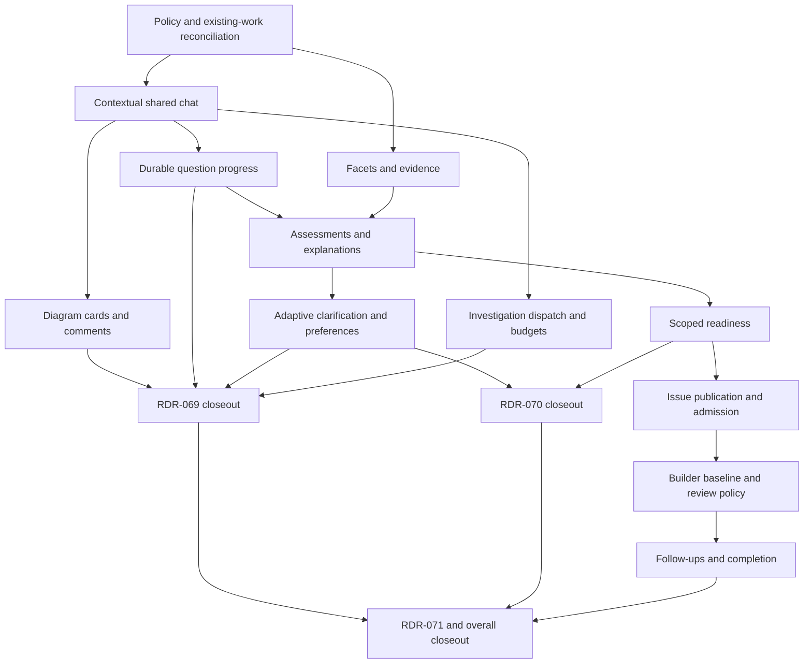

# Human-Centered Inbox: Implementation Issue Tree

## Design baseline and filing contract

This is a reviewable set of issue drafts for
[RDR-069](RDR-069-question-centered-chat-exploration.md),
[RDR-070](RDR-070-facet-confidence-and-clarification.md), and
[RDR-071](RDR-071-confidence-driven-issue-delivery.md). All three RDRs are
Accepted; no runtime behavior is implemented by this document.

The keys below are local draft identifiers, **not GitHub issue numbers**.
When filing, create the epic and task records, replace every local dependency
with its actual `Depends on #<number>` reference, add parent/child links, and
read back the bodies. Keep implementation issues under `planning` until the
design is finalized and merged; then remove that hold while preserving real
dependencies. Label the epic `epic`; do not leave runnable closeout issues
permanently excluded by `epic`, `tracking` or `planning` labels.

Each implementation task must update its linked LLD/EARS as needed, write
failing-first behavior tests, implement, and run relevant lint/coherence
checks. Do not mark planned EARS claims implemented without code/test evidence.
Use existing services and schema where possible. New database migrations use
Rails generators and tenant/foreign-key conventions. UI actions require
authorized API/tool parity. The acceptance criteria below are part of each
issue body, not optional implementation suggestions.

## Existing work and overlap

Checked on 2026-09-22 against main and GitHub issue bodies/comments:

| Existing work | Relationship and action |
|---|---|
| [#3877](https://github.com/viamin/paid/issues/3877), [#3891](https://github.com/viamin/paid/issues/3891), [#3925](https://github.com/viamin/paid/issues/3925) | Closed layout, question-context and chat-header work. Reuse shipped surfaces; do not refile these changes. |
| [#3864](https://github.com/viamin/paid/issues/3864) | Closed feature-decision Inbox work. Reuse feature links and access concepts; new policy does not ask for Mark approved. |
| [#3862](https://github.com/viamin/paid/issues/3862), [#3863](https://github.com/viamin/paid/issues/3863), [#3865](https://github.com/viamin/paid/issues/3865) | Open feature/linkage/admission work. Existing models already implement part of their scope. P01 audits shipped code and revises/reuses these tasks for shared foundations; P09/P10 cover only the new confidence-driven contract. Do not make the new tree depend on obsolete whole-feature approval acceptance criteria. |
| [#3867](https://github.com/viamin/paid/issues/3867), [#3868](https://github.com/viamin/paid/issues/3868), [#3869](https://github.com/viamin/paid/issues/3869) | Closed conformance/merge/amendment work. P11 adds explicit policy dispatch and removes amendment-pause behavior only for confidence-driven features. |
| [#3870](https://github.com/viamin/paid/issues/3870), [#3871](https://github.com/viamin/paid/issues/3871) | Open evaluation/closeout for approval-gated policy. Retain their scope; share fixtures/metrics where useful without claiming these tasks deliver the new policy. |
| [#3860](https://github.com/viamin/paid/issues/3860), [#3861](https://github.com/viamin/paid/issues/3861) | Existing approval-gated epics. Link the new epic and explain the policy boundary; do not silently close or rewrite completed implementation evidence. |
| [PR #3958](https://github.com/viamin/paid/pull/3958) | Open clarification-recovery fix. Rebase P04 on its outcome; do not recreate the stale-question recovery bug. |

Issue state is not proof of implementation. P01 must inspect the delivered
code/tests before reusing, editing, closing or superseding any existing task.
This proposal does not mutate any of the existing GitHub records.

## Dependency tree

## Epic E01 — Human-centered Inbox exploration and confidence-driven delivery

**Purpose:** Help people reach informed answers through contextual chat and
question-specific diagrams, then use explicit per-facet confidence to release
issues and complete features through forward work.

**Children:** P01–P12, C69, C70, C71. The epic is a coordination record.

**Acceptance:** All three RDRs have evidence-backed closeouts. A user can open
an Inbox question, explore/comment on a diagram, correct an assessment and see
why particular work can proceed. Later findings create completion-blocking
follow-ups without pausing active work. Only explicit preferences persist.

## P01 — Reconcile feature policy and existing implementation tasks

**Dependencies:** Finalized, merged RDR-069/070/071 and their LID documents.

**Scope:** Audit FeatureIntent/linkage/admission work, finalize explicit policy
selection for new features, and reconcile #3862/#3863/#3865 and their epics.
Implement the policy/enrollment foundation without enabling automatic release.

**Acceptance criteria:**

- [ ] Record shipped code/test evidence and reuse or revise overlapping tasks; no duplicate record models or contradictory run-admission tasks remain in the filed plan.
- [ ] Project selection and feature policy snapshot are authorized and audited; existing features retain their established policy.
- [ ] Enrollment cannot enable confidence-driven execution before P10–P12 wiring is present; a settings-only UI is insufficient.
- [ ] Disabling enrollment preserves active work, held issues and existing feature policies.
- [ ] Update the older RDR/intent scope links and add mixed-policy regression fixtures.

**Intent:** `CONFIDENCE-DELIVERY-001`, `014`, `015`.
**Likely touchpoints:** `Project`, `FeatureIntent`, configuration profiles,
`FeatureFlags`, onboarding and feature-approval intent.

## P02 — Open persistent contextual chat from Inbox questions

**Dependencies:** Depends on P01.

**Scope:** Add feature/standalone-issue conversation linkage and question focus
to existing Inbox and chat navigation. Support attributed project collaboration.

**Acceptance criteria:**

- [ ] Repeated/concurrent opens reuse the correct conversation and focus; another issue cannot silently repoint it.
- [ ] Related feature issues share context; standalone issues and unrelated projects remain separate.
- [ ] Project membership is checked for loads, sends, subscriptions and tools; queued actions act as the sender, not the session creator.
- [ ] Personal conversations are not exposed by attaching a feature; access removal is honored.
- [ ] Preserve return-to-Inbox navigation and usable desktop/mobile layout through existing shared styling.
- [ ] HTML, Cable, SSE and API/tool actions carry matching subject/actor context.

**Intent:** `QUESTION-EXPLORATION-001`, `007`, `012`.
**Likely touchpoints:** `ChatSession`, `ChatMessage`, policies, `ChatChannel`,
`chat_popup_controller.js`, chat and Inbox views.

## P03 — Add collapsible question-linked diagrams and comment inputs to chat

**Dependencies:** Depends on P02.

**Scope:** Add typed diagram messages and Paid-owned rendering, drawing on
Archify's semantic relationships and Diagram Design's readable composition.

**Acceptance criteria:**

- [ ] Every diagram identifies its question and includes a text comment input, collapsible summary, text equivalent and keyboard-accessible element selection.
- [ ] Comments include actor, question and selected element's textual context; stale element references never silently target another element.
- [ ] Validate descriptions, escape labels/links and prevent generated script execution; invalid output preserves textual exploration.
- [ ] Current diagrams survive reconnects; replacing one does not require retaining previous visual source.
- [ ] Collapse/selection/trial edits never record a preference or strengthen certainty; collapse does not discard unsent input.
- [ ] Browser tests cover narrow screens, overflow, keyboard interaction and chat transport updates.

**Intent:** `QUESTION-EXPLORATION-003`–`006`, `009`, `011`, `012`.
**Likely touchpoints:** Chat message serializers/renderers, Stimulus components,
`app/javascript/lib/safe_markdown.js` boundary, request/system specs.

## P04 — Persist per-question progress and answers from exploration

**Dependencies:** Depends on P02.

**Scope:** Bridge current clarifying-question production/submission into chat
progress and durable question/evidence records. Reconcile the outcome of #3958.

**Acceptance criteria:**

- [ ] Users can leave a question unresolved, answer others and resume later; exploration requests are not final answers.
- [ ] Preserve human comments and sufficient evidence context when temporary diagrams are deleted or replaced.
- [ ] Answer submission does not clear unrelated needs-input work; GitHub answer synchronization is idempotent and exposes failures.
- [ ] Archive/reconnect/research cancellation does not delete recorded intent or partial progress.
- [ ] Canonical design claims can reference the resulting answer; no requirement to retain a non-final diagram.

**Intent:** `QUESTION-EXPLORATION-002`, `004`–`006`, `013`.
**Likely touchpoints:** `ClarifyingQuestions::Load`, `SubmitAnswers`,
`ClearNeedsInput`, feature decision records and chat services.

## P05 — Model facets, attributable evidence and issue prerequisites

**Dependencies:** Depends on P01.

**Scope:** Extend existing feature/question links with facets, candidate
directions, evidence and issue prerequisite mapping.

**Acceptance criteria:**

- [ ] Store separate intent/technical assessments or unknown, bounded 0–100; unknown is not rejection or approval.
- [ ] Evidence retains attribution, source, supersession, time and textual context without requiring old diagram source.
- [ ] Mapping includes materiality rationale, coverage assessment and relevant design documents; empty unassessed mappings cannot pass.
- [ ] Enforce tenant ownership, foreign keys, access controls and idempotent evidence ingestion.
- [ ] Use generated migrations and audit configuration/intent records whose changes govern behavior.

**Intent:** `FACET-CONFIDENCE-001`, `002`, `008`.
**Likely touchpoints:** `FeatureIntentDecision`, feature/issue links, new
assessment/evidence storage and associated model/service tests.

## P06 — Assess and explain numerical intent and technical confidence

**Dependencies:** Depends on P04. Depends on P05.

**Scope:** Background assessment through agent_harness with a versioned rubric,
visible scores/explanations, and chat-based correction.

**Acceptance criteria:**

- [ ] Scores cite evidence and retain evidence/rubric/model revisions; stale, failed and malformed responses cannot produce readiness.
- [ ] Explicit corrections outweigh superseded statements; repeated agent output and duplicate evidence cannot inflate intent.
- [ ] Conflicting collaborators trigger clarification rather than automatic majority decisions.
- [ ] Users see numerical scores and reasoning and can challenge them in chat.
- [ ] No page render invokes per-entry LLM assessment; concurrent evidence changes reject obsolete output.
- [ ] Evaluation cases include unknown intent with a successful prototype and explicit intent with weak technical evidence.

**Intent:** `FACET-CONFIDENCE-002`–`005`, `012`–`014`.
**Likely touchpoints:** Assessment services/jobs, prompt definitions/migrations,
chat contextual presentation, agent_harness adapters already used by Paid.

## P07 — Ask discriminating questions and remember only explicit preferences

**Dependencies:** Depends on P06.

**Scope:** Adaptive clarification grounded in uncertain facets and inspection,
correction/deletion of explicitly stated preferences.

**Acceptance criteria:**

- [ ] Research available facts before asking; select an aid from context or ask how the user wants to investigate.
- [ ] A/B prompts distinguish plausible directions and accept both, neither, conditional and free-text answers.
- [ ] Preference persistence requires an explicit statement and explicit/clarified scope; clicks and assessment inference never create durable preferences.
- [ ] User preferences do not silently become project policy; permissions govern project-scoped changes.
- [ ] Evaluation covers method redirection, mouse/keyboard ambiguity, preference deletion and distinguishing contextual answers from general preferences.

**Intent:** `QUESTION-EXPLORATION-008`, `011`; `FACET-CONFIDENCE-006`, `007`.
**Likely touchpoints:** Chat prompts/tools, preference settings/services and
assessment context assembly.

## P08 — Run bounded investigations from the conversation

**Dependencies:** Depends on P02.

**Scope:** Reuse existing research/container/preview capabilities for investigations
chosen during exploration, with explicit budget and execution-policy enforcement.

**Acceptance criteria:**

- [ ] Context-appropriate investigations can start within configured authorization; requests beyond limits ask for additional authorization.
- [ ] Account for concurrent reservations/usage so two investigations cannot each spend the same available budget.
- [ ] Long work exposes progress/cancellation and reconnectable results attached to the question.
- [ ] Executable experiments use existing isolated runtimes, not raw code in chat HTML; failures preserve human progress.
- [ ] Do not require a prototype or diagram for every question; API/tool parity matches the UI.

**Intent:** `QUESTION-EXPLORATION-008`–`010`, `012`, `013`.
**Likely touchpoints:** Chat tool dispatch, existing cost budgets, container
capabilities, preview services and durable job/workflow execution.

## P09 — Evaluate scoped issue readiness and configurable 80/80 thresholds

**Dependencies:** Depends on P06.

**Scope:** Deterministic readiness over agent-authored prerequisite mapping,
current assessments and relevant merged design artifacts.

**Acceptance criteria:**

- [ ] Default intent and technical thresholds to 80 each; permit independent authorized/audited project changes within 0–100.
- [ ] Require every material prerequisite to pass; unknown or missing coverage fails visibly, and unrelated feature uncertainty does not block.
- [ ] Test exact boundaries, pending/failed assessments, current evidence revisions and relevant design-merge status; a merged document contradicting the released intent does not qualify.
- [ ] Research issues are assessed against the clarity/feasibility of investigation, not the uncertain implementation answer.
- [ ] Explain each blocker and retain the revisions/settings used to reach the result; shadow mode cannot release work.

**Intent:** `FACET-CONFIDENCE-008`–`012`; `CONFIDENCE-DELIVERY-003`, `014`.
**Likely touchpoints:** Readiness services, project settings, feature design
links and Inbox/chat readiness presentation.

## P10 — Publish held issues and enforce one automatic release contract

**Dependencies:** Depends on P09.

**Scope:** Reuse/reconcile #3863/#3865 foundations for confidence-driven issue
publication, workflow-owned planning holds, snapshots and all admission paths.

**Acceptance criteria:**

- [ ] Show speculative work in Paid and coherent held work in GitHub; create actual parent/dependency links with explicit dependency text.
- [ ] Release ready issues without whole-feature approval while preserving unrelated holds and relevant design-merge prerequisites.
- [ ] Snapshot admitted scope, policy, evidence/assessment revisions, thresholds and merged baseline.
- [ ] Auto-pick, eager queue, dequeue, API/chat/manual starts and run creation use the same contract.
- [ ] External label edits, failed sync and retries reconcile visibly and idempotently; missing assessments never pass by absence of a label.
- [ ] Serialize edits to unstarted scope against admission without holding database locks across GitHub calls.

**Intent:** `CONFIDENCE-DELIVERY-002`–`006`, `009`.
**Likely touchpoints:** Feature creation/LID output, dependency parser,
`Issues::EnqueueEligible`, auto-pick candidate source and run admission.

## P11 — Carry admitted intent to builders and dispatch conformance by policy

**Dependencies:** Depends on P10.

**Scope:** Builder context and review behavior use the confidence-driven
admitted baseline rather than approval-gated amendment pauses.

**Acceptance criteria:**

- [ ] Builders receive the applicable facet scores, evidence and alternatives with expressed intent distinguished from inferred fit.
- [ ] A later answer or feature revision alone does not pause/cancel a confidence-driven run or block its PR.
- [ ] Actual CI/security/quality/current-head/merge checks still apply; a confidence score is not a waiver.
- [ ] Approval-gated features keep their existing approval, amendment and final-merge behavior.
- [ ] Inbox reasons and API/tools use the selected policy consistently, without prompting for a nonexistent mandatory approval.
- [ ] Test mixed policies and later evidence against an active run's immutable baseline.

**Intent:** `FACET-CONFIDENCE-013`, `015`; `CONFIDENCE-DELIVERY-007`, `010`.
**Likely touchpoints:** Prompt context, `IntentConformance::Signal`,
`VerifyAtMerge`, `DesignAmendments::EvaluateImpact`, PR scanner and Inbox.

## P12 — Convert new findings into completion-blocking forward work

**Dependencies:** Depends on P11.

**Scope:** Idempotent follow-up creation, unstarted-issue edits, completion
dependencies and release-readiness reporting.

**Acceptance criteria:**

- [ ] New findings update suitable unstarted issues or create linked follow-ups; active runs continue even without feature-flag isolation.
- [ ] The completion issue contains explicit dependencies on all implementation/follow-up issues; remote writes are read back and retries cannot duplicate work.
- [ ] Pending writes and findings arriving during closeout prevent false completion; findings after completion reopen or establish a linked completion cycle.
- [ ] Completion verifies acceptance and actual flag/isolation status where applicable; activation requires existing project release authorization.
- [ ] Forward-work findings do not create a follow-up/completion dependency cycle or erase unrelated human controls.
- [ ] Enable confidence-driven enrollment only after P10/P11/P12 integration checks pass; disabling enrollment preserves existing work.

**Intent:** `CONFIDENCE-DELIVERY-007`–`015`.
**Likely touchpoints:** Design impact review, issue CRUD/dependency sync,
feature completion and release/flag reporting.

## C69 — Validate and close out question-centered chat exploration

**Dependencies:** Depends on P03. Depends on P04. Depends on P07. Depends on P08.

- [ ] Exercise an Inbox question through shared chat, diagram comment, method redirection, partial progress, reconnect and final answer.
- [ ] Verify the answer/evidence survives deletion of intermediate diagrams and chat archive.
- [ ] Verify access, transport parity, mobile/keyboard usability, budgets and cancellation with running tests.
- [ ] Follow the [RDR closeout checklist](closeout-checklist.md); store `audit-report-<date>-rdr-069.md`, file specific remaining gaps and update only evidence-supported statuses.

## C70 — Evaluate and close out facet confidence and clarification

**Dependencies:** Depends on P07. Depends on P09.

- [ ] Run the versioned assessment corpus and report false readiness, unnecessary clarification, human corrections, cost and rework.
- [ ] Prove numerical bounds, unknown handling, explicit preference provenance, correction precedence and 79/80 readiness behavior.
- [ ] Record that 80/80 defaults are provisional judgments rather than calibrated probabilities; do not tune scores solely to increase throughput.
- [ ] Follow the [RDR closeout checklist](closeout-checklist.md); store `audit-report-<date>-rdr-070.md` and file specific gaps before claiming implementation.

## C71 — Validate confidence-driven delivery and overall feature completion

**Dependencies:** Depends on P12. Depends on C69. Depends on C70.

- [ ] Demonstrate partial feature readiness, relevant design merge, automatic issue release and immutable builder context across every admission path.
- [ ] Introduce a contradictory answer during execution; prove work continues and the follow-up blocks completion, both with and without flags.
- [ ] Test external label edits, queued-run races, GitHub failure/retry, concurrent closeout findings and both feature policies.
- [ ] Reconcile the reused RDR-066/067 tasks without falsely claiming their separate policy work complete.
- [ ] Follow the [RDR closeout checklist](closeout-checklist.md); store `audit-report-<date>-rdr-071.md`, add dependencies for remaining gaps and close E01 only when the full acceptance criteria have shipped evidence.

## Review notes

- New EARS claims are all unchecked. Existing approval-gated claims retain
  their IDs and implementation markers, with their policy scope made explicit.
- New policy dispatch is itself unimplemented and covered by P01/P11, not
  implied by the documentation scope edits.
- No database, production feature flag, execution policy or GitHub issue is
  changed by this design package.
- LLD edge review covers shared-chat access, temporary-diagram stale comments,
  assessment/evidence races, empty mappings, remote write failure, admission
  concurrency, dependency direction and post-completion findings. These use
  the agreed product rules without adding new approval steps or run pauses.
