# Execution Runner — Docker Coupling Inventory

> **Status**: Living document. Catalog only — no solutions proposed.
> **Tracking issue**: [#3337](https://github.com/…) — Inventory and characterize Docker coupling in agent execution (historically filed under the provisional execution-runner `RDR-054` label).
> **Consumed by**: #3338–#3347 (execution-runner abstraction tree). This is the first issue in that tree and the reference these issues build on.
> **Scope**: Every place Docker concepts appear in the agent execution path, classified by concern and severity, ending with a dependency graph and the natural seams where a runner boundary could be drawn.

## Historical numbering note

The execution-runner issue tree (`#3336`–`#3348`) was created while the runner
boundary workstream temporarily used the label `RDR-054`. The repository's
current `docs/rdrs/RDR-054-prompt-assembly-service.md` is a different,
implemented RDR for prompt assembly. Treat this inventory as part of the
execution-runner/container-runtime workstream recorded in
`docs/intent/container-runtime/container-runtime-design.md`, not as part of the
current prompt-assembly RDR. The 2026-08-27 closeout audit
(`docs/rdrs/audit-report-2026-08-27-execution-runners-closeout.md`, tracked by
`#3661`) reconciles the full issue tree against that design and RDR-057/RDR-062.

## Purpose and how to read this document

Before an execution-runner abstraction is designed (#3338+), this document maps **every** Docker coupling point so the abstraction is not designed in a vacuum and no coupling is missed. Per the issue's non-goals, this document:

- **Catalogs the problem** — it does not propose solutions.
- **Does not assess** feasibility of specific remote-runner providers.
- **Records line references** so follow-up issues can point at concrete code.

Severity vocabulary used throughout:

| Severity | Meaning |
|---|---|
| **Structural** | The coupling is in a load-bearing interface, a persisted schema, a control-flow assumption, or a security/execution primitive. Replacing Docker requires changing this contract. |
| **Semantic** | The code assumes Docker-specific execution semantics (blocking exec streams, exit codes, inspect JSON, stats JSON) but does not own a persisted contract. Abstraction requires rethinking the interaction model, not just renaming. |
| **Cosmetic** | Just naming or incidental references (a column called `container_*`, a doc comment). Renaming suffices; no behavioral contract changes. |

## 1. Executive summary

Paid's agent execution is built directly on the Docker Engine API, accessed through the `docker-api` Ruby gem. There is already a `Containers::Backends::Base` interface, but it is a **transport-routing layer** (which Docker daemon: local socket, remote TLS, or Swarm manager), **not a runtime-agnostic runner abstraction**. Every concrete backend `require "docker-api"` and delegates to `Docker::*` classes; the Swarm backend additionally issues raw HTTP to the Swarm `/services`, `/nodes`, `/tasks` endpoints.

The single deepest coupling is the **execution model itself**: agent commands run via `backend.exec_in_container` — a blocking, hijacked HTTP stream whose only reliable interrupt is `backend.stop_container` (Excon can swallow `Thread.raise`). This forces an entire **watchdog architecture** that is duplicated four times (once in `Containers::Provision`, then copied into the three knowledge runners). It also forces a **host-filesystem heartbeat duality** (host bind-mount `File.mtime` vs. in-container `docker exec stat -c %Y`).

The coupling fans out across seven concerns: container lifecycle, execution & monitoring, networking, storage/workspace, image selection, authentication & secrets, and supporting sidecars (services, MCP, browser, preview). It reaches into the Temporal activity/workflow layer, the ActiveRecord domain model (seven Docker-named tables/columns), and a dozen background jobs.

The **natural seams** — where a runner boundary can be drawn with the least disruption — are concentrated in four places: (a) the `container_service.execute` abstraction used by `GitOperations`/`TokenOptimization`/`HarnessExecutor`; (b) the `AgentRun#with_container` / `execute_in_container` bridge; (c) the `Containers::Backends::Base` interface itself (which must be re-sculpted, not replaced wholesale); and (d) the three intentionally Docker-free `Runners::SubscriptionAuth*` registries, which already model the right shape for capability-based routing.

## 2. The backend abstraction layer (the chokepoint)

Every coupling point below ultimately flows through this layer, so it is characterized first.

### `app/services/containers.rb` — the module-level entry point

`Containers` (`app/services/containers.rb:3`) is the façade the rest of the app uses to reach a Docker backend:

- `Containers.backend` (`:9`) — resolves the active backend from `config.x.container_backend` / `CONTAINER_BACKEND` env.
- `Containers.backend_for(host)` (`:22`) — resolves **which** backend owns a given `container_host`; the universal join between persisted host IDs and live daemons.
- `Containers.all_backends` (`:31`) — enumerates every backend for cross-host sweeps (orphans, pool replenishment).
- Constants: `LOCAL_BACKEND_KEY`, `REMOTE_BACKEND_KEY`, `CONTAINER_NOT_RUNNING_PATTERN` (`:6`) — a regex matching Docker's "is not running / No such container" errors, matched across the codebase.

### `app/services/containers/backends/base.rb` — the interface contract (26 methods)

`Containers::Backends::Base` (`app/services/containers/backends/base.rb`) is a 26-method abstract interface that is a **near 1:1 mirror of the `docker-api` gem API**. Every method name is Docker terminology:

| Method | Line | Docker concept |
|---|---|---|
| `remote?` | 6 | backend transport (default `false`) |
| `identifier` | 10 | host identity |
| `supports_host_paths?` | 14 | bind-mount capability (default `true`) |
| `owns_host?(host)` | 18 | host ownership |
| `ping` | 22 | `Docker.ping` daemon liveness |
| `system_info` | 26 | `Docker.info` |
| `container_host_for(container)` | 41 | daemon address for a container |
| `get_container(id)` | 45 | `Docker::Container.get` |
| `create_container(config)` | 49 | `Docker::Container.create` |
| `start_container(container)` | 53 | `container.start` |
| `stop_container(container, **)` | 57 | `container.stop` |
| `delete_container(container, **)` | 61 | `container.delete` |
| `exec_in_container(container, command, **)` | 65 | `container.exec` (docker exec) |
| `container_stats(container, **)` | 69 | `container.stats` |
| `container_logs(container, **)` | 73 | `container.streaming_logs` |
| `list_containers(**)` | 77 | `Docker::Container.all` |
| `get_network(name)` | 81 | `Docker::Network.get` |
| `create_network(name, config)` | 85 | `Docker::Network.create` |
| `pull_image(config)` | 89 | `Docker::Image.create` |
| `get_image(name)` | 93 | `Docker::Image.get` |
| `list_volumes` | 97 | `Docker::Volume.all` |
| `create_volume(name, options, host:, **)` | 101 | `Docker::Volume.create` |
| `get_volume(name, host:)` | 105 | `Docker::Volume.get` |
| `delete_volume(volume, **)` | 109 | `volume.remove` |

**Severity: Structural.** This is the contract every Docker operation flows through. It is the most important single artifact in the coupling map.

### Concrete backends — all `require "docker-api"`

| Backend | File | Coupling |
|---|---|---|
| `LocalDocker` | `app/services/containers/backends/local_docker.rb` | Local Unix socket via gem default. `Docker.ping` (`:15`), `Docker::Container.get/.create/.all` (`:27,31,59`), `Docker::Network.get/.create` (`:63,67`), `Docker::Image.create/.get` (`:71,75`), `Docker::Volume.*` (`:79-91`). |
| `RemoteDocker` | `app/services/containers/backends/remote_docker.rb` | TLS `Docker::Connection` over TCP/2376 from `REMOTE_DOCKER_*` env (`:18-36,128-154`). Every call passes the explicit `connection`. `remote? => true` (`:38`), `supports_host_paths? => false` (`:42`). |
| `Swarm` | `app/services/containers/backends/swarm.rb` | Most Docker-coupled. Speaks the **Swarm manager HTTP API** directly: `/services/create` (`:136`), `/services/#{id}` (`:150,168,247`), `/nodes` (`:475,489`), `/tasks` (`:534`). Translates `HostConfig` into a Swarm `service_spec` (`:277`). Resolves concrete containers per-node (`:396,501`). Parses Swarm labels `paid.docker_host` (`:12,505`). |

**Severity: Structural** (all three). They are the only implementations of the contract above.

## 3. Master inventory

Every file/class that references Docker concepts in the execution path. "Concern" maps to §4. "Sev." is §4 severity (S = structural, Se = semantic, C = cosmetic).

### 3.1 Container services (`app/services/containers/`)

| File | Concern | Sev. | Nature of coupling |
|---|---|---|---|
| `containers.rb` | Lifecycle | S | Backend façade; `backend_for`/`all_backends`; `CONTAINER_NOT_RUNNING_PATTERN` |
| `provision.rb` | Lifecycle, Exec, Storage, Auth, Services | S | Primary orchestrator (~4,637 lines); ~30 `exec_in_container` sites; builds `HostConfig`/`Binds`/`Tmpfs`/`NetworkMode`/`Memory` inline; watchdog; heartbeat; credential seeding |
| `backends/base.rb` | Lifecycle | S | 26-method Docker-mirror interface |
| `backends/local_docker.rb` | Lifecycle | S | `require "docker-api"`; local socket |
| `backends/remote_docker.rb` | Lifecycle | S | `require "docker-api"`; TLS connection |
| `backends/swarm.rb` | Lifecycle | S | `require "docker-api"`; raw Swarm HTTP API |
| `backends/resolver.rb` | Lifecycle | S | backend factory |
| `git_operations.rb` | Exec (git) | Se | In-container git via injected `container_service.execute`; no direct daemon calls |
| `harness_executor.rb` | Exec | Se | Adapts `agent_run.execute_in_container` to `agent-harness` `CommandExecutor` (`@spec AGENT-HARNESS-002`) |
| `streaming_event_processor.rb` | Exec | Se | Parses JSONL from docker exec stdout; `:abort` triggers `stop_container` |
| `collect_metrics.rb` | Monitoring | Se | `container_stats(stream: false)`; rescues `Docker::Error::NotFoundError` |
| `collect_service_metrics.rb` | Monitoring | Se | Same shape for service containers |
| `docker_stats_parser.rb` | Monitoring | Se | Hardcoded Docker stats JSON schema (`cpu_stats`/`memory_stats`/`pids_stats`) |
| `health_check.rb` | Monitoring | Se | `backend.ping`; consumed by `BackendScheduler` |
| `host_readiness.rb` | Monitoring | Se | Direct read probes: `ping`/`system_info`/`get_network`/`get_image` |
| `host_registry.rb` | Lifecycle | S | Builds backend objects from `CONTAINER_BACKENDS_CONFIG` YAML |
| `backend_scheduler.rb` | Lifecycle | S | Host selection; `Provision.compatibility_for` + `HealthCheck.ping` |
| `resolve_host_for_run.rb` | Lifecycle | S | DB-record host placement at run creation (`@spec CONTAINER-RUNTIME-002`) |
| `heartbeat_setup.rb` | Monitoring | C | Pure config/preparation generation (no daemon calls); describes container paths |
| `network_policy.rb` | Networking | S | Docker network creation, iptables via `exec_in_container`, DNS proxy |
| `proxy_url.rb` | Networking | S | Docker DNS (`paid-proxy`) vs external URL resolution |
| `image_resolver.rb` | Storage/Image | Se | Resolves `paid-agent:<tokens>` image tags from language profile |
| `pool_manager.rb` | Lifecycle/Storage | S | Warm pool of pre-created containers; named volumes |
| `pool_warmer.rb` | Lifecycle | S | Predictive pool scaling (via `PoolManager`) |
| `service_provisioner.rb` | Services | S | Postgres/Redis/Selenium/Chromium sidecars; DNS aliases; `docker exec psql` |
| `tcp_health_probe.rb` | Monitoring | Se | TCP probe: `docker exec` (remote) / direct socket (local) |
| `mcp_provisioner.rb` | Services (MCP) | S | Docker image MCP servers as sidecar containers on Docker network |
| `chat_session_manager.rb` | Lifecycle | S | Chat container lifecycle; `Containers.backend` directly |
| `provision_for_chat.rb` | Lifecycle | S | Chat container provisioning; full `HostConfig` |
| `quality_hooks.rb` | Exec | C | Pure command resolution; delegates to injected `git_ops` |
| `token_optimization.rb` | Exec | C | rtk/CodeGraph init via injected `container_service.execute` |
| `capability_messages.rb` | Lifecycle | — | (auxiliary; reviewed — minor/incidental) |

### 3.2 Other services

| File | Concern | Sev. | Nature of coupling |
|---|---|---|---|
| `network_policy.rb` | Networking | S | (listed above under containers; referenced from many callers) |
| `worktree_service.rb` | Storage | Se | Host-side git worktree creation; `worktree_path` persisted on `AgentRun` |
| `agent_runs/verification.rb` | Services (browser) | S | Playwright/Chromium container on Docker network; DNS alias `paid-screenshot-browser` |
| `previews/tunnel_manager.rb` | Services (preview) | S | Rathole client via `docker exec`; label-based container enumeration |
| `previews/lifecycle.rb` | Services (preview) | S | Orchestrates Docker-backed preview provisioning/teardown |
| `previews/provision.rb` | Services (preview) | S | Composes all Docker-backed services for previews |
| `runners/subscription_auth_providers.rb` | Auth | C | Provider registry; **intentionally Docker-free** (returns container paths/contents) |
| `runners/subscription_auth_host_paths.rb` | Auth | C | Predicate gating Docker host bind mounts; pure logic |
| `runners/subscription_auth_materializers.rb` | Auth | C | Registry declaring remote-safe materializers; pure data |
| `runners/test_agent.rb` | Lifecycle | Se | Runner smoke test; indirect via `with_container`/`HarnessExecutor` |
| `test_agent_health_check_fallback.rb` | Lifecycle | Se | Host-vs-container health-check fallback for smoke test |
| `knowledge/containerized_runner.rb` | Lifecycle/Exec | S | Host clone + tar stream into container; own `HostConfig`; stop-container watchdog |
| `knowledge/embedding_runner.rb` | Lifecycle/Exec | S | Own container; host bind mount; firewall; watchdog |
| `knowledge/analysis_runner.rb` | Lifecycle/Exec | S | Own container; cgroup `HostConfig`; watchdog |
| `chat_sessions/restore_clone_manifest.rb` | Exec | Se | Uses `exec_in_container` to restore chat state |
| `claude_login_sessions/interactive_login.rb` | Exec | Se | Interactive login via `exec_in_container` |
| `mcp/tools/run_shell.rb` | Exec | Se | Shell exec inside container |
| `mcp/tools/container_repo_support.rb` | Exec | Se | Repo ops inside container |
| `mcp/tools/clone_project.rb` | Exec | Se | Clone inside container |
| `performance_benchmarks/ci_seed_data.rb` | Storage | C | Fixture seed using `paid-pool-workspace-` volume name |

### 3.3 Domain models (`app/models/`)

| File | Concern | Sev. | Nature of coupling |
|---|---|---|---|
| `agent_run.rb` | Lifecycle | S | Owns provisioning methods; persists `container_id`/`container_host`/`service_container_ids`/`mcp_sidecar_container_ids` |
| `service_container.rb` | Lifecycle | S | `docker_container_id`, `container_host`, Docker lifecycle `status` |
| `container_pool_entry.rb` | Lifecycle/Storage | S | Warm-pool state record; `container_id`, `workspace_volume` |
| `container_metric.rb` | Monitoring | S | Docker stats samples keyed by `container_id` |
| `service_container_metric.rb` | Monitoring | S | Same for service containers |
| `docker_host.rb` | Lifecycle | S | Persisted Docker backend target; TLS material; readiness |
| `project_service_container.rb` | Services | C | Join table (transitive via `ServiceContainer`) |
| `preferred_docker_host_identifier_validation.rb` | Lifecycle | Se | Validates placement preference against `docker_hosts` |
| `project.rb` | Lifecycle | Se | `preferred_docker_host_identifier`; `has_running_database_container?` |
| `tenant_setting.rb` | Lifecycle | Se | `preferred_docker_host_identifier` |
| `runner.rb` | Auth | Se | Subscription-auth source; runner placement implications |
| `runner_auth_attempt.rb` | Auth | C | Auth attempt records |
| `preview_session.rb` | Services | Se | Preview container state |
| `chat_session.rb` / `chat_message.rb` | Lifecycle | C | Chat container references |
| `account.rb` | Lifecycle | Se | `has_many :docker_hosts`, `:service_containers` |
| `agent_run_phase.rb` | Lifecycle | C | Phase tracking (container phase keys) |
| `agent_run_resource_profile.rb` | Monitoring | C | Memory/OOM profiling keyed off container metrics |
| `exception_incident.rb` | Monitoring | C | Incidents referencing container failures |
| `failure_classification.rb` | Monitoring | C | Docker error-message classification keywords |
| `issue.rb` | Lifecycle | C | Incidental references |
| `mcp_server_definition.rb` | Services | Se | MCP install type (`docker_image` vs `npx`) |
| `user_setting.rb` | Lifecycle | C | Preferred host |

### 3.4 Temporal (`app/temporal/`)

| File | Concern | Sev. | Nature of coupling |
|---|---|---|---|
| `activities/provision_container_activity.rb` | Lifecycle | S | `agent_run.provision_container`; heartbeat/drain; leak prevention |
| `activities/cleanup_container_activity.rb` | Lifecycle | S | `agent_run.cleanup_container(force: true)` |
| `activities/provision_services_activity.rb` | Services | S | `ServiceProvisioner#provision` on Docker network |
| `activities/cleanup_services_activity.rb` | Services | S | `ServiceProvisioner#cleanup` |
| `activities/provision_mcp_servers_activity.rb` | Services (MCP) | S | `McpProvisioner#provision` (docker_image sidecars) |
| `activities/cleanup_mcp_servers_activity.rb` | Services (MCP) | S | `McpProvisioner#cleanup` |
| `activities/provision_browser_container_activity.rb` | Services (browser) | S | `AgentRuns::Verification` browser container |
| `activities/clone_repo_activity.rb` | Exec (git) | Se | `Provision.reconnect` + `GitOperations` in-container |
| `activities/push_branch_activity.rb` | Exec (git) | Se | In-container git push |
| `activities/rebase_branch_activity.rb` | Exec (git) | Se | In-container git rebase |
| `activities/run_agent_activity.rb` | Exec | S | ~4,005 lines; `container_service.execute`; OOM/reprovision error handling; `Docker::Error::DockerError` |
| `activities/retain_container_activity.rb` | Lifecycle | Se | Sets `container_retained_until`; host `df` disk check |
| `activities/create_worktree_activity.rb` | Storage | C | Host worktree (legacy); no direct Docker |
| `activities/cleanup_worktree_activity.rb` | Storage | C | DB record only |
| `activities/run_collectors_activity.rb` | Lifecycle | S | Knowledge collectors via `ContainerizedRunner` |
| `activities/requeue_infra_failure_activity.rb` | Lifecycle | Se | Re-queues Docker pull/DNS infra failures |
| `activities/handle_no_output_issue_run_activity.rb` | Monitoring | Se | Regex-matches Docker container failure messages |
| `activities/create_agent_run_activity.rb` | Lifecycle | C | `NON_CONTAINER_GOALS` constant |
| `workflows/agent_execution_workflow.rb` | Lifecycle | S | Orchestrates all provision/cleanup activities; `KNOWN_FAILURE_TYPES` incl. `ContainerNotProvisioned`; `should_retain_container?` |

### 3.5 Jobs (`app/jobs/`)

| File | Concern | Sev. | Nature of coupling |
|---|---|---|---|
| `docker_orphan_cleanup_job.rb` | Lifecycle | S | MAXIMAL — dedicated Docker reaper; iterates `all_backends`; volume prefixes; container labels |
| `service_container_reconciliation_job.rb` | Services | S | MAXIMAL — reconciles `ServiceContainer` rows against live Docker `State.Running` |
| `agent_run_cancellation_job.rb` | Lifecycle | S | `require "docker-api"`; `cleanup_container(force: true)` |
| `agent_run_resource_janitor_job.rb` | Lifecycle | S | Second-chance volume/container cleanup; `paid-workspace-` prefix |
| `container_metrics_collection_job.rb` | Monitoring | Se | `CollectMetrics` on `container_id` |
| `service_container_metrics_collection_job.rb` | Monitoring | Se | `CollectServiceMetrics` on `docker_container_id` |
| `pool_replenishment_job.rb` | Lifecycle | S | `PoolManager.replenish` across all backends |
| `stale_run_detector_job.rb` | Lifecycle | Se | Resets `container_id`/`service_container_ids`; calls `Provision.reconnect`/`ServiceProvisioner.cleanup` |
| `chat_sessions/provision_container_job.rb` | Lifecycle | S | Eager chat workspace container |
| `claude_credential_keep_warm_job.rb` | Auth | S | Provisions a container purely to keep credentials warm |
| `preview_sessions/provision_job.rb` | Services | Se | Preview via `Previews::Provision` |
| `preview_sessions/expire_job.rb` | Services | Se | Preview teardown via `Previews::Teardown` |
| `process_run_queue_job.rb` | Lifecycle | Se | Queue dispatcher; `BackendScheduler`; `container_host` semantics |
| `worktree_orphan_cleanup_job.rb` | Storage | C | Git worktrees (not Docker); incidental comment |
| `scheduled_mutation_sweep_job.rb` | Exec | C | `include Containers::QualityHooks` (transitive) |

### 3.6 Database schema (Docker-named tables/columns)

Full table/column detail in §5. Summary: seven tables are Docker-shaped — `agent_runs` (container columns), `service_containers`, `container_pool_entries`, `container_metrics`, `service_container_metrics`, `docker_hosts`, `project_service_containers`.

## 4. Classification by concern

### 4.1 Container lifecycle (Structural)

The primary orchestrator is **`Containers::Provision`** (`app/services/containers/provision.rb`, ~4,637 lines, ~189 KB). It owns the full container lifecycle and is the densest coupling point in the system.

Key public/entry methods:

- `provision` (`:245`) — primary orchestrator entry point.
- `execute(command, ...)` (`:328`) — runs a command in the container (see §4.2).
- `cleanup(force: false)` (`:806`) — `backend.delete_container(container, force:, v: true)`.
- `container_running?` (`:839`).
- `self.with_container(agent_run:, worktree_path:, **options)` (`:925`) — block wrapper.
- `self.reconnect(agent_run:, container_id:, worktree_path:, workspace_volume:)` (`:896`) — rehydrate onto an existing container (used by every Temporal activity after provisioning).
- `self.network_for(agent_run:)` (`:175`).

It directly constructs Docker container configuration:

- `container_config` (`:2403`), `host_config` (`:2424`) — builds `HostConfig` with `Binds` (`:2425-2458`), `NetworkMode` (`:2541`), `Memory`/`MemorySwap` (`:2532-2535`), `CpuQuota` (`:2537`), `Tmpfs` (`:2466-2529, 2539`).
- `create_container` (`:2379`) → `backend.create_container(container_config)`.
- `start_container` (`:2383`) → `backend.start_container(container)`.

The lifecycle is mirrored by the **`AgentRun` model** (`app/models/agent_run.rb`), which owns the persistent handle and orchestrates provisioning/cleanup:

- `provision_container(**options)` (`:2392`), `cleanup_container(force:)` (`:2422`), `recover_in_flight_container!` (`:2466`), `with_container(**options)` (`:2492`), `execute_in_container` (`:2406`), `cleanup_orphaned_workspace_volume` (`:2814`), `invalidate_container_after_stale_provision!`.

**Warm pool** (`pool_manager.rb`, `pool_warmer.rb`) pre-creates containers and named volumes, then `Provision.reconnect` rehydrates a run onto a pooled container.

**Other full-lifecycle owners** (parallel mini-provisioners that go deep through `Containers.backend` rather than `Containers::Provision`):

- `Containers::ChatSessionManager` (`chat_session_manager.rb`) — `require "docker-api"`; own container/volume lifecycle.
- `Containers::ProvisionForChat` (`provision_for_chat.rb`) — `require "docker-api"`; full `HostConfig`.
- `Knowledge::ContainerizedRunner` (`knowledge/containerized_runner.rb`) — host clone + Docker tar stream + own `HostConfig` + stop-container watchdog.
- `Knowledge::EmbeddingRunner` / `Knowledge::AnalysisRunner` — own short-lived containers with cgroup config + watchdog.

**Severity: Structural.** Container creation/deletion, the `HostConfig`/cgroup shape, and the reconnect contract are all load-bearing. Every Temporal activity depends on `Provision.reconnect`.

### 4.2 Execution & monitoring (Structural / Semantic)

This is the deepest *semantic* coupling in the system.

**`execute` and the watchdog.** `Containers::Provision#execute` (`:328`) → `execute_unlocked` (`:440`) calls `backend.exec_in_container(container, cmd_array, **exec_options)` at `:504`. `exec_options` includes `wait: timeout` (`:444`) — a Docker-daemon-side concept. The exec returns a `[stdout, stderr, exit_code]` tuple (`:629`), which is the `docker-api` gem's return contract.

The blocking nature of `docker exec`'s hijacked HTTP stream forces the watchdog architecture:

- `start_watchdog` (`:4393`) spawns a `Thread` polling every `watchdog_poll_interval` (1s, `:4476`).
- On timeout/abort, `watchdog_stop_container!` (`:4484`) calls `backend.stop_container(container, timeout: 0)` (SIGTERM→SIGKILL) up to 3 attempts to **unblock the exec stream**. The comment at `:4380-4390` explains this is more reliable than `Thread.raise`, which Excon can swallow.
- The streaming callback also calls `backend.stop_container` directly on abort events (`:532, :559, :576`).
- This **stop-container-to-unblock-exec pattern is duplicated three more times**: `knowledge/containerized_runner.rb:462`, `knowledge/embedding_runner.rb:125`, `knowledge/analysis_runner.rb:314` — each explicitly noting it matches `Provision#execute`.

**Docker API shapes assumed throughout:**

- **Exit 137** (128 + SIGKILL) → treated as likely cgroup OOM (`:648`). `oom_exit_diagnostics` (`:853`) reads `container.info["State"]["OOMKilled"]`, `["Running"]`, `info.dig("HostConfig","Memory")` — **Docker inspect JSON field names**.
- **Clock skew** between the Docker daemon and `CLOCK_MONOTONIC` is explicitly handled (`DOCKER_TIMEOUT_SKEW_TOLERANCE = 0.5`, `:44`) to reclassify transport errors as timeouts.
- `rescue Docker::Error::DockerError` (`:683`) and `ExecutionError.new("Docker exec error: ...")` (`:775`).

**Heartbeat liveness — host/container filesystem duality:**

- `heartbeat_age_seconds` (`:4542`) / `heartbeat_mtime` (`:4569`).
- **Host path** (`:4573`): `File.mtime` on a **host temp dir bind-mounted** into the container at `/paid-heartbeat` (`HEARTBEAT_MOUNT_POINT`, `:38`; bind at `:2433`).
- **Container path** (`:4581`): when no host bind is possible (volume-backed/Swarm), runs `backend.exec_in_container(container, ["sh","-lc","test -e #{path} && stat -c %Y #{path}"], ...)` to probe epoch mtime.
- Heartbeat temp dir on host created by `prepare_heartbeat_dir!` (`:2262`) under `Dir.tmpdir/paid-heartbeat-<hex>`, chmod 0777; validated against path traversal by `valid_heartbeat_dir?` (`:2300`).

**Streaming event parsing.** `Containers::StreamingEventProcessor` (`streaming_event_processor.rb`) parses JSONL from docker exec stdout (primarily Codex `--json`). It is **not directly Docker-coupled** (operates on strings), but its `:abort` action triggers `backend.stop_container` back in `provision.rb:532`. Architectural coupling: it consumes the docker exec stdout stream as a line buffer.

**Metrics collection** — three thin layers over the Docker stats API:

- `CollectMetrics` (`collect_metrics.rb`) / `CollectServiceMetrics` (`collect_service_metrics.rb`) — `container_stats(stream: false)`; rescue `Docker::Error::NotFoundError`.
- `DockerStatsParser` (`docker_stats_parser.rb`) — hardcodes the **Docker stats JSON schema**: `cpu_stats`/`precpu_stats`/`memory_stats`/`pids_stats`.

**Health checks:**

- `Containers::HealthCheck` (`health_check.rb:50`) — `backend.ping`; cached; consumed by `BackendScheduler`.
- `Containers::HostReadiness` (`host_readiness.rb`) — direct read probes `ping`/`system_info`/`get_network`/`get_image`, labeled `"docker_ping"`/`"docker_tls"` (`:123-136`).
- `Containers::TcpHealthProbe` (`tcp_health_probe.rb`) — `remote?` → `docker exec` probe script (`:18`); local → direct `Socket.tcp` (`:31`).

**Severity: Structural (exec model) + Semantic (shapes).** The blocking-exec + stop-container watchdog is the hardest coupling to abstract because it is a property of the Docker Engine HTTP exec protocol, not just an API call. Any runner boundary must redefine "execute a command and observe a heartbeat" without assuming a stoppable blocking stream.

### 4.3 Networking (Structural)

**`NetworkPolicy`** (`app/services/network_policy.rb`) owns Docker network and firewall management:

- Networks: `NETWORK_NAME = "paid_agent"` (`:37`), `INFRA_NETWORK_NAME = "paid_internal"` (`:42`), `NETWORK_SUBNET = "172.28.0.0/16"` (`:44`).
- `ensure_network!` (`:104`), `create_network` (`:300`) — builds a `bridge` driver with IPAM; production sets `Internal: true` and disables IP masquerade; `backend.create_network` (`:321`).
- **iptables firewall applied via `backend.exec_in_container`** — `apply_firewall_rules` (`:137`) runs a shell script (`build_firewall_script` `:371`) inside the container: `iptables -P OUTPUT DROP`, allow DNS/secrets-proxy/GitHub CIDRs/services, log+drop else (`:386-408`).
- `default_proxy_destination` (`:351`) — local backends use Docker DNS name `paid-proxy` (`:356`); remote use external URL.

**`Containers::ProxyUrl`** (`proxy_url.rb`):

- `resolve(backend:, restricted:)` (`:9`) — remote requires `PAID_PROXY_EXTERNAL_URL`; local uses Docker DNS (`paid-proxy` / `web`).

Wired into provisioning: `ensure_network!` (`provision.rb:4090`), `apply_network_restrictions!` (`:4097`), `NetworkMode` in `host_config` (`:2541`).

**Severity: Structural.** Docker bridge networks, DNS aliases, and in-container iptables are the network isolation security model (RDR-004). A runner abstraction must reproduce network isolation semantics, not just network names.

### 4.4 Storage & workspace (Structural)

**Docker named volumes:**

- `paid-workspace-{agent_run_id}` — per-run workspace. Created in `prepare_workspace!` (`provision.rb:2161`); reconstructed for cleanup in `agent_run.rb:2817`, `agent_run_resource_janitor_job.rb`, `docker_orphan_cleanup_job.rb`.
- `paid-pool-workspace-{id}` — warm-pool workspace (`pool_manager.rb:194`).
- `paid-collector-{project_id}-{hex}` — knowledge collector volumes (`knowledge/containerized_runner.rb:254`).

**Host bind mounts (legacy worktree path):**

- `WorktreeService` (`worktree_service.rb`) creates host-side git worktrees under `/var/paid/workspaces`; `worktree_path` persisted on `AgentRun`.
- `host_config` (`provision.rb:2424`) chooses named-volume (`:2428`) vs. host bind mount (`:2430`, when `backend.supports_host_paths?`). `validate_backend_mount_support!` (`:2795`) rejects host-path runs on non-host backends.

**tmpfs mounts** — configured in `host_config` (`provision.rb:2466-2529`) as `"Tmpfs" => tmpfs` (`:2539`): `/paid-heartbeat`, `/tmp` (1GB, exec), `/home/agent/.cache` (512MB, exec), plus per-runner config dirs (`.claude`, `.codex`, `.gemini`, `.cursor-agent`, `.kilocode`, `.config/kilocode`, `.local/share/kilo`, `.config/opencode`, `.local/share/opencode`, `.copilot`). Each has a corresponding `fix_*_tmpfs_ownership!` post-start chown.

**Heartbeat temp dirs on host filesystem** — see §4.2.

**Severity: Structural.** The volume lifecycle, the host-bind-vs-volume decision, and the tmpfs layout (with exec flags needed for native extension builds / `pty.node` dlopen) are all Docker-cgroup/filesystem specific.

### 4.5 Image selection (Semantic)

**`Containers::ImageResolver`** (`image_resolver.rb`) resolves `paid-agent:<tokens>` image tags from the project's detected language profile (RDR-046):

- `BASE_IMAGE = "paid-agent:latest"` (`:28`) bundles Ruby/Node/Python.
- `EXTENDED_LANGUAGES = %w[elixir go rust swift]` (`:36`).
- `tag_for` (`:136`) → `paid-agent:<sorted-tokens>` (e.g. `paid-agent:elixir-node-python-ruby`).
- Consumed by `pool_manager.rb:141` so warmed containers match requested images.

**Severity: Semantic.** The image is a Docker concept, but the *resolution logic* (language → tag) is policy that could map to a runner capability. Coupling is to the image-tag-as-build-artifact model.

### 4.6 Authentication & secrets (Structural / Cosmetic)

This concern spans the deepest and the cleanest coupling in the system.

**Host-filesystem path detection via Docker mount inspection** (Structural): four methods in `Containers::Provision` support the DooD (Docker-outside-of-Docker) devcontainer pattern where Paid itself runs inside a container:

- `current_container_mounts` (`provision.rb:4044`) — `local_runtime_backend.get_container(Socket.gethostname)`, reads `container.info["Mounts"]`.
- `detected_config_mount(suffix)` (`:4014`) — finds a mount by `Destination` suffix.
- `detect_host_config_path(suffix)` (`:4003`) — returns the host-side `Source` path.
- `docker_host_path_for(path)` (`:4023`) — translates container-internal path to host-side equivalent.

**Credential seeding via `backend.exec_in_container`** (Structural) — writes files into the container's tmpfs/writable layer:

- Primitives: `seed_host_credentials!` (`:1935`), `seed_local_credentials!` (`:1949` — base64 + `docker exec` pipe-to-decode), `write_container_file` (`:2256`).
- Per-provider: `seed_claude_credentials!` (`:1270`), `seed_codex_*` (`:1322, 1352, 1424, 1439`), `seed_codex_notify_hook!` (`:1509`), `seed_gemini_credentials!` (`:1764`), `seed_copilot_credentials!` (`:1828`), `seed_opencode_database!` (`:1698`), `seed_kilo_database!` (`:1735`).

**Codex/Claude credential refresh with host filesystem locks** (Structural) — `flock` on the Paid host serializes concurrent runs sharing a rotating OAuth refresh token:

- Codex host: `with_codex_host_auth_lock` (`:1571`), `codex_auth_lockfile_path` (`:3362`), `sync_codex_auth_file_to_source!` (`:3377` — reads rotated credential *out of* the container via `docker exec base64`, writes back to host).
- Codex managed: `with_codex_managed_auth_lock` (`:1615`), `harvest_codex_managed_credential_impl!` (`:3611`).
- Claude: `with_claude_auth_lock` (`:3794`), `exchange_claude_refresh_token!` (`:3905` — harness writes back to host dir).

**Subscription auth registries (Cosmetic / the clean seam):**

- `Runners::SubscriptionAuthProviders` (`runners/subscription_auth_providers.rb`) — provider adapter registry; **intentionally Docker-free**; returns container paths/contents, delegates `refresh`/`harvest` back to the provisioner.
- `Runners::SubscriptionAuthHostPaths` (`runners/subscription_auth_host_paths.rb`) — predicate gating host bind mounts.
- `Runners::SubscriptionAuthMaterializers` (`runners/subscription_auth_materializers.rb`) — registry declaring `remote_safe` materializers.

**Severity: Structural** (mount inspection, credential seeding, file-lock refresh) **+ Cosmetic** (the three registries, which are the cleanest-designed seams in the codebase and a model for capability-based routing).

### 4.7 Supporting services & sidecars (Structural)

**`Containers::ServiceProvisioner`** (`service_provisioner.rb`) provisions Postgres/Redis/Selenium/Chromium as Docker containers:

- `provision` (`:104`) joins the agent run's Docker network; records `service_container_ids`.
- `create_docker_container` (`:433`) sets `NetworkMode`, resource limits, and DNS `"Aliases" => [host]` (`:450-456`) — services resolved by Docker DNS name.
- **Per-run database creation via `docker exec psql`** — `create_per_run_database` (`:664`) runs `CREATE DATABASE` via `backend.exec_in_container`; `drop_per_run_database` (`:764`) runs `pg_terminate_backend` + `DROP DATABASE`.
- `generate_env_vars` (`:621`) builds `DATABASE_URL`/`REDIS_URL`/`SELENIUM_URL` using DNS hostnames.

**`Containers::McpProvisioner`** (`mcp_provisioner.rb`) provisions Docker image MCP servers as sidecars:

- `provision_docker_sidecar` (`:139`) — `NetworkMode`, DNS alias `paid-mcp-<name>-run<id>`, labels.
- Records `mcp_sidecar_container_ids` on `AgentRun` (`:92-95`) for cleanup.
- `npx` servers are stdio (no sidecar) — only `docker_image` install type creates containers.

**`AgentRuns::Verification`** (`agent_runs/verification.rb`) provisions a Playwright/Chromium browser container:

- `create_browser` (`:163`) — `NetworkMode`, DNS alias `paid-screenshot-browser` (`:32`), labels `paid.verification_browser`.
- `track_sidecar_id` (`:221`) appends to `mcp_sidecar_container_ids` so MCP cleanup also removes the browser.

**Preview tunnels** (`previews/tunnel_manager.rb`, `previews/lifecycle.rb`, `previews/provision.rb`) provision preview containers with a rathole tunnel client:

- `TunnelManager.start_client!` (`:405`) writes rathole config + launches `rathole --client` via `docker exec`.
- `list_preview_containers` (`:317`) enumerates Docker containers by label `paid.preview_tunnel=true`.
- `provision.rb` `preview_tunnel_*` methods (`:2173-2246`) wire the tunnel into a normal agent-run container.

**Severity: Structural.** All sidecars assume Docker networks + DNS aliases + container IDs persisted on `AgentRun` for cleanup. Per-run DB creation via `docker exec psql` is especially Docker-specific.

## 5. Domain model Docker naming (schema detail)

These persisted columns are the durable contract that makes Docker a first-class concept in the data model. References are `db/schema.rb`.

### `agent_runs` (table at `schema.rb:228`)

| Column | Line | Comment |
|---|---|---|
| `container_host` | 242 | "Container backend host identifier used to provision and reconnect to this run's container." default `"local"` |
| `container_id` | 243 | Docker container id (limit 128) |
| `container_metrics_count` | 244 | counter cache |
| `container_retained_until` | 245 | retention TTL |
| `mcp_sidecar_container_ids` | 273 | jsonb — "Docker container IDs of MCP sidecar containers provisioned for this run" |
| `service_container_ids` | 295 | jsonb — array of `ServiceContainer` IDs |
| `service_environment` | 296 | jsonb — env vars for service containers |
| `worktree_path` | 313 | host bind-mount path (legacy) |
| `external_metadata` | — | carries `planned_container_host`, `container_host_selection` |

### `service_containers` (table at `schema.rb:2513`)

`docker_container_id` (`:2520`), `container_host` (`:2517`, comment: "Container backend host identifier that currently owns the running service container."), `status` (`:2528`, Docker lifecycle states `stopped/starting/running/error`), Docker metrics aggregates.

### `container_pool_entries` (table at `schema.rb:691`)

Table comment: "warm-container pool slot that can be pre-provisioned, claimed by a run, or recycled after failure." Columns: `container_id` (`:695`), `container_host` (`:694`), `workspace_volume` (`:704`, comment: "Docker volume that preserves the prepared workspace for fast reuse."), `image`, `network`, `status` (`:701`, `warming/warm/claimed/error`). Unique indexes on `container_id` (`:706`) and `workspace_volume` (`:710`).

### `container_metrics` (table at `schema.rb:675`)

`container_id` (`:677`, limit 128, null false), `cpu_percent`, `memory_bytes`, `memory_limit_bytes`, `memory_percent`, `pids_count` (`:678-683`). Purely Docker stats samples.

### `service_container_metrics` (table at `schema.rb:2496`)

Identical shape to `container_metrics`, keyed by `service_container_id` (`:2505`).

### `docker_hosts` (table at `schema.rb:962`)

Table comment: "Persisted Docker backend targets and readiness metadata for account-level run placement." Columns: `identifier` (`:979`, "Stable host identifier persisted onto agent_runs.container_host"), `backend_type` (`:964`, "local, remote, or swarm"), `endpoint`, TLS material (all `encrypts`), `readiness_status`, `image_status`, `required_network_status`, `manual_concurrency_limit`, `fallback_eligible`. The most "Docker-as-infrastructure" model.

### `project_service_containers` (table at `schema.rb:1953`)

Pure join table (`project_id` ↔ `service_container_id`). No Docker columns; transitive coupling via `ServiceContainer`.

### The universal join key

**`container_host`** is the universal join key across `agent_runs`, `service_containers`, `container_pool_entries`, corresponding to `docker_hosts.identifier`. `Containers.backend_for(host)` / `Containers.all_backends` is the single seam where Docker-as-database-id meets Docker-as-runtime-daemon. Every HEAVY/MAXIMAL job crosses it.

## 6. Dependency graph

How the coupling points interconnect. Read top-down: the Temporal workflow drives activities; activities call services; services call the backend interface; the backend talks to Docker.

```mermaid
flowchart TD
    subgraph Temporal["Temporal orchestration"]
        WF["AgentExecutionWorkflow<br/>(provision/cleanup activity ordering,<br/>KNOWN_FAILURE_TYPES, should_retain_container?)"]
        ProvA["ProvisionContainerActivity"]
        CloneA["CloneRepoActivity / PushBranchActivity / RebaseBranchActivity"]
        RunA["RunAgentActivity (~4k lines)"]
        SvcA["Provision/CleanupServicesActivity"]
        McpA["Provision/CleanupMcpServersActivity"]
        BrowserA["ProvisionBrowserContainerActivity"]
    end

    subgraph Services["Service layer"]
        Prov["Containers::Provision (~4.6k lines)<br/>provision / execute / cleanup / reconnect"]
        GitOps["Containers::GitOperations<br/>(in-container git via container_service.execute)"]
        Harness["Containers::HarnessExecutor<br/>(agent-harness CommandExecutor adapter)"]
        SvcProv["Containers::ServiceProvisioner<br/>(docker exec psql, DNS aliases)"]
        McpProv["Containers::McpProvisioner<br/>(docker_image sidecars)"]
        Verify["AgentRuns::Verification<br/>(playwright browser container)"]
        NetPol["NetworkPolicy<br/>(paid_agent / paid_internal, iptables)"]
        Pool["PoolManager / PoolWarmer<br/>(warm containers)"]
        SubAuth["Runners::SubscriptionAuth*<br/>(Docker-free registries — clean seam)"]
        KnowRun["Knowledge runners<br/>(own containers + watchdog)"]
        Chat["ChatSessionManager / ProvisionForChat<br/>(own lifecycle)"]
        Previews["Previews::*<br/>(rathole tunnel + containers)"]
    end

    subgraph Backend["Backend abstraction (chokepoint)"]
        Base["Containers::Backends::Base<br/>(26-method docker-api mirror)"]
        Local["LocalDocker"]
        Remote["RemoteDocker (TLS)"]
        Swarm["Swarm (raw /services /nodes /tasks HTTP)"]
    end

    subgraph Model["ActiveRecord domain model"]
        AR["AgentRun<br/>(container_id/host, provision_container, with_container)"]
        SC["ServiceContainer / ContainerPoolEntry<br/>ContainerMetric / DockerHost"]
    end

    subgraph Jobs["Background jobs"]
        Orphan["DockerOrphanCleanupJob<br/>ServiceContainerReconciliationJob"]
        Janitor["AgentRunResourceJanitorJob<br/>StaleRunDetectorJob"]
        Metrics["ContainerMetricsCollectionJob<br/>CollectMetrics / DockerStatsParser"]
        Replenish["PoolReplenishmentJob"]
    end

    WF --> ProvA & CloneA & RunA & SvcA & McpA & BrowserA
    ProvA --> AR
    RunA --> Harness
    Harness --> AR
    CloneA --> GitOps
    GitOps --> Prov
    AR -->|"provision_container / with_container"| Prov
    ProvA & SvcA & McpA & BrowserA --> Prov & SvcProv & McpProv & Verify
    Prov --> NetPol
    Prov --> Pool
    Prov --> SubAuth
    Verify & McpProv --> SC
    SvcProv --> SC
    Prov & SvcProv & McpProv & Verify & KnowRun & Chat & Previews --> Base
    Base --> Local & Remote & Swarm
    Local & Remote & Swarm -.->|'require docker-api'| Docker[("Docker Engine API")]
    Orphan --> Base
    Janitor --> Prov
    Metrics --> Base
    Replenish --> Pool
```

### Cross-cutting dependencies (not shown in the graph)

- **`Docker::Error::DockerError`** is rescued across: `provision.rb`, all three concrete backends, `collect_metrics.rb`, `collect_service_metrics.rb`, `chat_session_manager.rb`, `provision_for_chat.rb`, `knowledge/*_runner.rb`, `agent_run_cancellation_job.rb`, `agent_run_resource_janitor_job.rb`, `docker_orphan_cleanup_job.rb`, `service_container_reconciliation_job.rb`, and `run_agent_activity.rb`. It is an implicit cross-cutting contract.
- **`container_host`** is the persisted join key threaded from `AgentRun` → `Containers.backend_for` → backend → daemon, and back into every cleanup/metrics job.
- **The stop-container-to-unblock-exec watchdog** is duplicated in `provision.rb` and the three knowledge runners — a behavioral dependency, not a code dependency.

## 7. Natural seams for the runner boundary

These are the places where a runner boundary can be drawn with the least disruption. They are identified, not prescribed — per the issue's non-goals, this document does not propose solutions.

### Seam 1 — `container_service.execute` (cleanest today)

`Containers::GitOperations`, `Containers::TokenOptimization`, and `Containers::HarnessExecutor` all consume an injected `container_service` exposing `execute(command, ...)` and `container_running?`. **No Docker knowledge leaks** through this seam today — swap the object behind it and these callers are unaffected. This is the closest thing to an existing runner-execution interface.

### Seam 2 — `AgentRun#with_container` / `execute_in_container`

`app/models/agent_run.rb:2492` (`with_container`) and `:2406` (`execute_in_container`) already wrap `Containers::Provision.with_container` and `container_service.execute`. `Runners::TestAgent` and `Containers::HarnessExecutor` route through here. This is the model-level seam that separates "what runs" from "where it runs."

### Seam 3 — `Containers::Backends::Base` (must be re-sculpted, not replaced wholesale)

The 26-method interface is the structural chokepoint. It conflates two concerns that a runner abstraction would separate: **lifecycle/placement** (create/delete/start/stop container, networks, volumes, images) and **execution** (exec, stats, logs, ping). The execution subset (`exec_in_container`, `container_stats`, `container_logs`, `ping`) is the natural runner-execution surface; the lifecycle subset is the natural runner-management surface. The `supports_host_paths?` / `remote?` capability flags already hint at the capability-based shape a runner contract would need.

### Seam 4 — `Runners::SubscriptionAuth*` (the design exemplar)

The three subscription-auth registries are **intentionally Docker-free**: they return container paths/contents and delegate Docker work back to the provisioner via `refresh`/`harvest`. They are the cleanest-designed seams in the codebase and model the right shape for capability-based runner routing (data registries that gate backend selection without touching the daemon).

### Seam 5 — Temporal activity boundaries

The workflow already sequences provisioning, services, MCP, browser, clone, run, and cleanup as **separate activities**. These activity boundaries are natural runner-contract operations. `RunAgentActivity`'s error classification (`transient_container_error?`, `container_unavailable_for_fallback?`, `reprovision_container_for_fallback!`) is where Docker error semantics leak most heavily into orchestration.

### Seam 6 — `container_host` as the persisted placement boundary

`container_host` / `docker_hosts.identifier` is the universal join between the persisted world and the runtime world. It is the natural point at which "this run executes on backend X" becomes a pluggable routing decision rather than a Docker-daemon selector.

### Hardest-to-abtract coupling (crosses all seams)

Three coupling patterns are not localized to a single seam and will constrain any runner design:

1. **Blocking-exec + stop-container watchdog** (§4.2) — a property of the Docker exec protocol, duplicated four times. A runner contract must redefine "execute and observe a heartbeat" without assuming a stoppable blocking stream.
2. **Host-filesystem credential locks + in-container harvest** (§4.6) — `flock` on the host plus `docker exec` to read rotated credentials back. This assumes co-located host and container filesystems.
3. **Docker inspect/stats JSON field assumptions** (§4.2) — `State.OOMKilled`, `HostConfig.Memory`, `cpu_stats`, `memory_stats`. These are not abstracted anywhere; they are parsed inline and in `DockerStatsParser`.

## 8. Coverage checklist

Files from the issue's "Areas to Inspect" plus additional files discovered:

- [x] Container lifecycle: `provision.rb`, `backends/base.rb`, `local_docker.rb`, `remote_docker.rb`, `swarm.rb`, `agent_run.rb`
- [x] Execution & monitoring: `provision.rb#execute`, `streaming_event_processor.rb`, `collect_metrics.rb`, `collect_service_metrics.rb`, `docker_stats_parser.rb`, `health_check.rb`
- [x] Networking: `network_policy.rb`, `proxy_url.rb`
- [x] Storage & workspace: named volumes, bind mounts, tmpfs, heartbeat dirs, `pool_manager.rb`, `pool_warmer.rb`, `worktree_service.rb`
- [x] Image selection: `image_resolver.rb`
- [x] Auth & secrets: `detected_config_mount`/`docker_host_path_for`/`current_container_mounts`, credential seeding, `runners/subscription_auth_*`, Codex/Claude refresh locks
- [x] Supporting services: `service_provisioner.rb`, `tcp_health_probe.rb`
- [x] MCP sidecars: `mcp_provisioner.rb`
- [x] Browser/preview: `agent_runs/verification.rb`, `previews/tunnel_manager.rb`, `previews/lifecycle.rb`, `previews/provision.rb`, `provision.rb#preview_tunnel_*`
- [x] Temporal activities: all 14 listed + `run_collectors_activity`, `requeue_infra_failure_activity`, `handle_no_output_issue_run_activity`
- [x] Temporal workflow: `agent_execution_workflow.rb`
- [x] Domain model: all seven Docker-named tables + the `preferred_docker_host_identifier_validation` concern
- [x] Jobs: all 7 listed + `service_container_reconciliation_job`, `chat_sessions/provision_container_job`, `claude_credential_keep_warm_job`, `preview_sessions/*`, `process_run_queue_job`, `worktree_orphan_cleanup_job`, `scheduled_mutation_sweep_job`
- [x] Other callers: `git_operations.rb`, `chat_session_manager.rb`, `provision_for_chat.rb`, `knowledge/containerized_runner.rb`, `knowledge/embedding_runner.rb`, `knowledge/analysis_runner.rb`, `runners/test_agent.rb`, `harness_executor.rb`
- [x] Additional discovered: `host_readiness.rb`, `host_registry.rb`, `backend_scheduler.rb`, `resolve_host_for_run.rb`, `quality_hooks.rb`, `token_optimization.rb`, `heartbeat_setup.rb`, `capability_messages.rb`, MCP tools (`run_shell`, `container_repo_support`, `clone_project`), `chat_sessions/restore_clone_manifest.rb`, `claude_login_sessions/interactive_login.rb`

## References

- [RDR-004](../rdrs/RDR-004-container-isolation.md) — Container Isolation Strategy (the security model this coupling implements).
- [RDR-019](../rdrs/RDR-019-remote-container-execution.md) — Remote Container Execution (the `backends/*` transport-routing layer).
- [RDR-020](../rdrs/RDR-020-service-container-architecture.md) — Service Container Architecture.
- [RDR-041](../rdrs/RDR-041-subscription-runner-auth-lifecycle.md) — Subscription Runner Managed Auth Lifecycle.
- [RDR-045](../rdrs/RDR-045-live-web-app-preview-agent-verification.md) — Live Web App Preview / Agent Verification.
- [RDR-046](../rdrs/RDR-046-polyglot-language-detection-and-test-execution.md) — Polyglot Language Detection (image selection).
- [RDR-048](../rdrs/RDR-048-multi-host-docker-backend-support.md) — Multi-Host Docker Backend Support (`container_host` placement).
